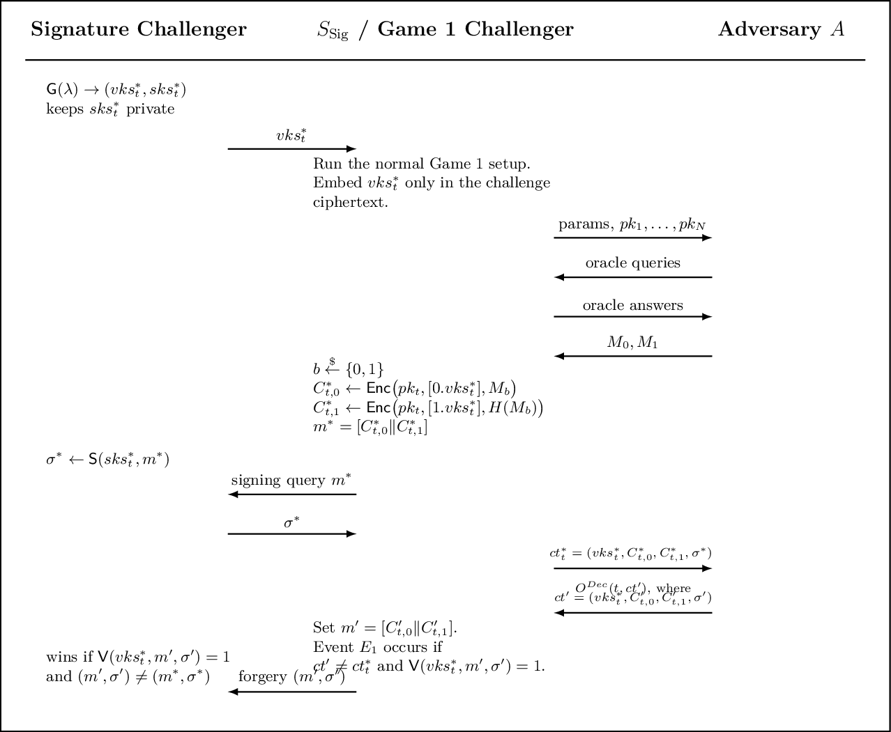
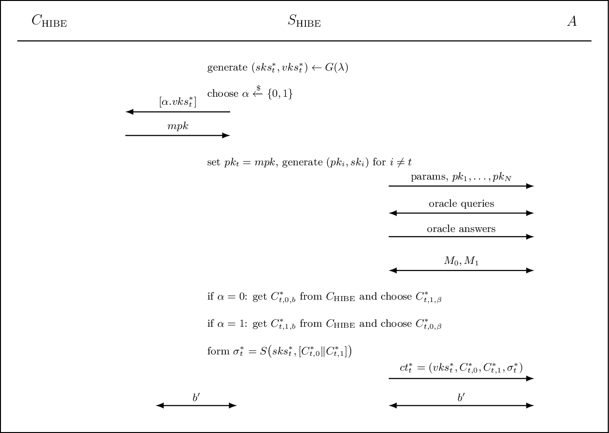
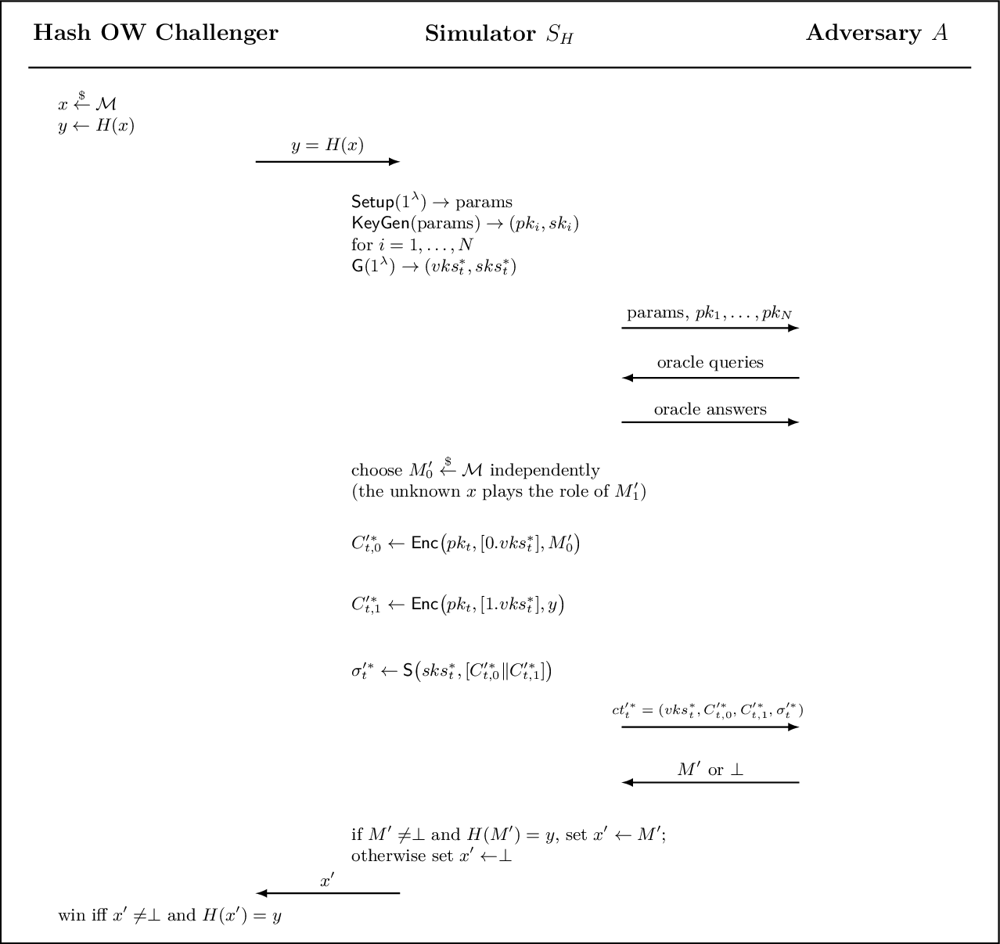
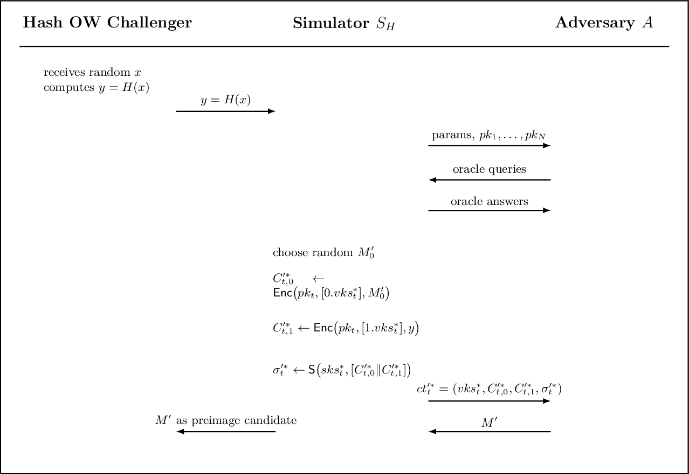
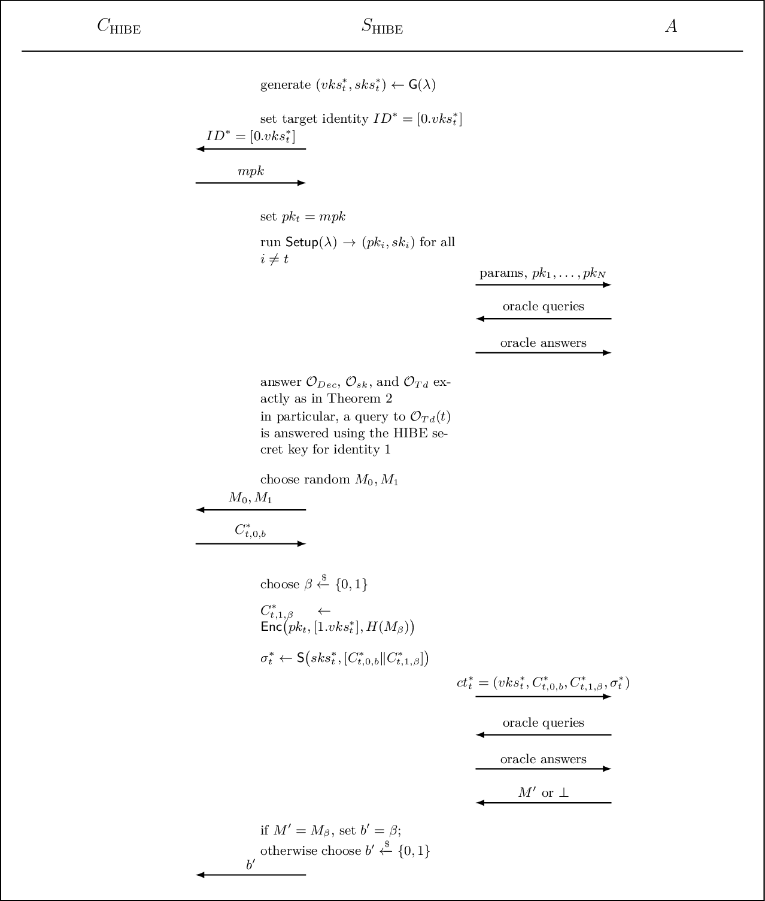

# Public-Key Encryption with Equality Test

Public-key encryption with equality test (PKEET) lets an authorized tester decide whether two ciphertexts hide the same plaintext, even when the ciphertexts were created under different public keys. The tester learns the equality relation, but should not learn the plaintexts themselves.

This note studies the generic standard-model construction of Lee, Ling, Seo, Wang, and Youn. Its main ingredients are a two-level HIBE scheme, a strongly unforgeable one-time signature, and a cryptographic hash function.

## 1. Motivation and unavoidable leakage

Suppose two users encrypt records before sending them to a server. Ordinary randomized public-key encryption hides equality: encrypting the same message twice normally gives unrelated ciphertexts. PKEET adds controlled comparison:

```text
ct_i = Enc(pk_i, M_i) ──┐
                        ├── Test(td_i, td_j, ct_i, ct_j) ∈ {0, 1}
ct_j = Enc(pk_j, M_j) ──┘
```

The test result reveals whether $M_i=M_j$, but not the messages directly.

This functionality has an important cost. A tester with the target user's trapdoor can encrypt guesses under a public key and compare them with the target ciphertext. Therefore, low-entropy messages such as short status codes or values from a small dictionary are vulnerable to exhaustive guessing. The usual Type-I security model consequently asks only for one-way security and assumes a sufficiently large, high-min-entropy message distribution.

## 2. PKEET syntax

A PKEET scheme consists of six probabilistic polynomial-time algorithms:

1. **Setup**

   $$pp \leftarrow Setup(1^\lambda)$$

   It generates public parameters for security parameter $\lambda$. The message space $\mathcal{M}$ is included in, or determined by, $pp$.

2. **Key generation**

   $$(pk_i,sk_i)\leftarrow KeyGen(pp)$$

   Each user $U_i$ receives a public/secret key pair.

3. **Encryption**

   $$ct_i\leftarrow Enc(pk_i,M_i)$$

4. **Decryption**

   $$M_i'\leftarrow Dec(sk_i,ct_i)$$

   The result is a message or $\perp$.

5. **Trapdoor generation**

   $$td_i\leftarrow Td(sk_i)$$

6. **Equality test**

   $$Test(td_i,td_j,ct_i,ct_j)\rightarrow\{0,1\}$$

   The algorithm returns $1$ when the ciphertexts are judged to encrypt the same message.

### Correctness

For honestly generated keys and ciphertexts, a correct PKEET scheme must satisfy three properties.

First, ordinary decryption recovers the message:

$$
\Pr[Dec(sk_i,Enc(pk_i,M_i))=M_i]=1.
$$

Second, equal messages test equal, including across different users:

$$
M_i=M_j
\quad\Longrightarrow\quad
\Pr[Test(td_i,td_j,ct_i,ct_j)=1]=1.
$$

Third, unequal messages produce a false positive only with negligible probability:

$$
M_i\ne M_j
\quad\Longrightarrow\quad
\Pr[Test(td_i,td_j,ct_i,ct_j)=1]\leq \operatorname{negl}(\lambda).
$$

The third property is where collision resistance of the hash function will be used.

## 3. Building blocks

### 3.1 Two-level HIBE

For the full HIBE background, see my [IBE and HIBE notes](learning-IBE-HIBE.html). Here we need the following interface:

$$
\begin{aligned}
(mpk,msk) &\leftarrow HIBE.Setup(1^\lambda,1^2),\\
sk_{ID'} &\leftarrow HIBE.KeyExt(sk_{ID},ID'),\\
C &\leftarrow HIBE.Enc(mpk,ID,M),\\
M' &\leftarrow HIBE.Dec(sk_{ID},C).
\end{aligned}
$$

An identity $[ID_1.ID_2]$ has two levels. A secret key for the prefix $[ID_1]$ can derive keys for all descendants $[ID_1.ID_2]$, but not for a different first-level branch.

The construction reserves two branches:

```text
root
├── [0]
│   └── [0.vk]  encrypts M
└── [1]
    └── [1.vk]  encrypts H(M)
```

The level-one key for branch $[1]$ will become the equality-test trapdoor.

### 3.2 Strongly unforgeable one-time signatures

Let

$$Sig=(Sig.KGen,Sig.Sign,Sig.Verify).$$

The algorithms are:

$$
\begin{aligned}
(vk_s,sk_s)&\leftarrow Sig.KGen(1^\lambda),\\
\sigma&\leftarrow Sig.Sign(sk_s,m),\\
b&\leftarrow Sig.Verify(vk_s,m,\sigma).
\end{aligned}
$$

Strong unforgeability is stricter than ordinary existential unforgeability. After seeing a signature on $m$, the adversary must be unable to create any new valid message-signature pair, including a different valid signature on the same message.

Only one ciphertext is signed under each ephemeral verification key, so a one-time signature is sufficient.

### 3.3 Hash function

We use

$$H:\mathcal{M}\rightarrow\mathcal{M}_{HIBE}.$$

The hash must be:

- collision-resistant for equality-test correctness; and
- one-way for Type-I security, because the tester can recover $H(M)$.

### 3.4 The CHK idea

The Canetti–Halevi–Katz transformation turns selectively secure identity-based encryption into CCA-secure public-key encryption:

1. generate a fresh one-time signature key pair;
2. use the verification key as the encryption identity;
3. sign the resulting ciphertext.

If an attacker modifies a challenge ciphertext while keeping the same verification key, the modified ciphertext needs a fresh valid signature. If it uses another verification key, the simulator can request the corresponding HIBE secret key because that identity is not the selectively committed challenge identity.

PKEET applies this idea to both branches $[0.vk_s]$ and $[1.vk_s]$.

## 4. Security models

PKEET is a multi-user primitive. Let $t$ be the target user's index. The adversary may interact with:

- $O^{sk}(i)$, which returns $sk_i$;
- $O^{Dec}(i,ct)$, which returns $Dec(sk_i,ct)$; and
- $O^{Td}(i)$, which returns $td_i$.

The target secret key may not be requested, and the challenge pair $(t,ct_t^*)$ may not be submitted to the decryption oracle.

### 4.1 Type-I: OW-CCA2

A Type-I adversary may obtain $td_t$, so it can perform equality tests involving the challenge ciphertext. Indistinguishability is impossible in this setting: given candidate messages, the adversary can encrypt and test them.

The challenger instead samples a hidden message $M^*$, gives

$$ct_t^*\leftarrow Enc(pk_t,M^*),$$

and the adversary wins by outputting $M'=M^*$.

Using the baseline-adjusted convention from these notes:

$$
Adv_{\mathcal{A}}^{OW\text{-}CCA2}(\lambda)
=
\left|
\Pr[M'=M^*]-\frac{1}{|\mathcal{M}|}
\right|.
$$

The target trapdoor query is allowed, but the target secret-key query and direct decryption of $ct_t^*$ are forbidden.

### 4.2 Type-II: IND-CCA2

A Type-II adversary does not receive $td_t$. It chooses equal-length messages $M_0,M_1$. The challenger samples $b\leftarrow\{0,1\}$ and returns:

$$ct_t^*\leftarrow Enc(pk_t,M_b).$$

The adversary outputs $b'$ and has advantage

$$
Adv_{\mathcal{A}}^{IND\text{-}CCA2}(\lambda)
=
\left|
\Pr[b'=b]-\frac12
\right|.
$$

Queries $O^{sk}(t)$, $O^{Td}(t)$, and $O^{Dec}(t,ct_t^*)$ are forbidden.

## 5. Generic PKEET construction

Let:

- $HIBE=(HIBE.Setup,HIBE.KeyExt,HIBE.Enc,HIBE.Dec)$ be a two-level HIBE scheme;
- $Sig=(Sig.KGen,Sig.Sign,Sig.Verify)$ be a strongly unforgeable one-time signature; and
- $H$ be the hash function described above.

To avoid confusing a user's secret key with an HIBE identity key, this section writes a user's PKEET secret key as $msk_i$ and an identity secret key as $d_{i,ID}$.

### 5.1 Setup

$$pp\leftarrow Setup(1^\lambda)$$

Publish descriptions and compatible parameters for $HIBE$, $Sig$, $H$, and the message space.

### 5.2 Key generation

For user $U_i$, run:

$$
(mpk_i,msk_i)\leftarrow HIBE.Setup(1^\lambda,1^2).
$$

Set:

$$pk_i=mpk_i,\qquad sk_i=msk_i.$$

### 5.3 Encryption

To encrypt $M$ under $pk_i=mpk_i$:

1. Generate an ephemeral signature key pair:

   $$
   (vk_s,sk_s)\leftarrow Sig.KGen(1^\lambda).
   $$

2. Encrypt the message on branch $0$:

   $$
   C_0\leftarrow HIBE.Enc(mpk_i,[0.vk_s],M).
   $$

3. Encrypt its hash on branch $1$:

   $$
   C_1\leftarrow HIBE.Enc(mpk_i,[1.vk_s],H(M)).
   $$

4. Bind the two components:

   $$
   \sigma\leftarrow Sig.Sign(sk_s,C_0\mathbin\Vert C_1).
   $$

5. Output:

   $$
   ct=(vk_s,C_0,C_1,\sigma).
   $$

### 5.4 Decryption

Given $sk_i=msk_i$ and $ct=(vk_s,C_0,C_1,\sigma)$:

1. Reject if

   $$
   Sig.Verify(vk_s,C_0\mathbin\Vert C_1,\sigma)=0.
   $$

2. Derive the two identity keys:

   $$
   \begin{aligned}
   d_{i,[0.vk_s]}&\leftarrow HIBE.KeyExt(msk_i,[0.vk_s]),\\
   d_{i,[1.vk_s]}&\leftarrow HIBE.KeyExt(msk_i,[1.vk_s]).
   \end{aligned}
   $$

3. Decrypt:

   $$
   \begin{aligned}
   M'&\leftarrow HIBE.Dec(d_{i,[0.vk_s]},C_0),\\
   h'&\leftarrow HIBE.Dec(d_{i,[1.vk_s]},C_1).
   \end{aligned}
   $$

4. Return the recovered message when the hash check succeeds:

   $$
   H(M')=h'.
   $$

   Otherwise, return $\perp$.

The signature prevents mixing or modifying $C_0$ and $C_1$, while the hash check ensures that they encode consistent values.

### 5.5 Trapdoor generation

Derive the level-one key for branch $[1]$:

$$
td_i=d_{i,[1]}\leftarrow HIBE.KeyExt(msk_i,[1]).
$$

This key can derive $d_{i,[1.vk_s]}$ for any second-level verification key, but it cannot derive a key on branch $[0]$. Consequently, it exposes the hash component needed for testing without exposing the message component.

### 5.6 Equality test

Given $td_i,td_j$ and:

$$
\begin{aligned}
ct_i&=(vk_{s,i},C_{i,0},C_{i,1},\sigma_i),\\
ct_j&=(vk_{s,j},C_{j,0},C_{j,1},\sigma_j),
\end{aligned}
$$

derive:

$$
\begin{aligned}
d_{i,[1.vk_{s,i}]}&\leftarrow
HIBE.KeyExt(td_i,vk_{s,i}),\\
d_{j,[1.vk_{s,j}]}&\leftarrow
HIBE.KeyExt(td_j,vk_{s,j}).
\end{aligned}
$$

Then recover:

$$
\begin{aligned}
h_i&\leftarrow HIBE.Dec(d_{i,[1.vk_{s,i}]},C_{i,1}),\\
h_j&\leftarrow HIBE.Dec(d_{j,[1.vk_{s,j}]},C_{j,1}).
\end{aligned}
$$

Return $1$ if $h_i=h_j$, and $0$ otherwise.

For honest ciphertexts:

$$
h_i=h_j
\quad\Longleftrightarrow\quad
H(M_i)=H(M_j).
$$

Thus equal messages always match, while unequal messages match only when they cause a hash collision.

## 6. Security analysis

### 6.1 IND-CCA2 against Type-II adversaries

**Theorem 2.** If the two-level HIBE scheme is IND-sID-CPA secure and the one-time signature is strongly unforgeable, then the PKEET construction is IND-CCA2 secure against Type-II adversaries.

Let $\epsilon_{HIBE}$ be an upper bound on the advantage of any PPT adversary against the IND-sID-CPA security of HIBE, and let $\epsilon_{Sig}$ be an upper bound on the probability of breaking the strong unforgeability of the one-time signature. Then:

$$
Adv_{\mathcal{A}}^{IND\text{-}CCA2}
\leq
2\epsilon_{HIBE}+\frac32\epsilon_{Sig}.
$$

#### Security games

Let $N$ be the number of users, let $t$ be the target user's index, and write the challenge ciphertext as:

$$
ct_t^*=(vk_{s,t}^*,C_{t,0}^*,C_{t,1}^*,\sigma_t^*).
$$

**Game 0.** This is the original IND-CCA2 game against a Type-II adversary. The real challenge is:

$$
ct_t^*=
(vk_{s,t}^*,C_{t,0,b}^*,C_{t,1,b}^*,\sigma_t^*),
$$

where:

$$
\begin{aligned}
(vk_{s,t}^*,sk_{s,t}^*)&\leftarrow Sig.KGen(1^\lambda),\\
C_{t,0,b}^*&\leftarrow HIBE.Enc(pk_t,[0.vk_{s,t}^*],M_b),\\
C_{t,1,b}^*&\leftarrow HIBE.Enc(pk_t,[1.vk_{s,t}^*],H(M_b)),\\
\sigma_t^*&\leftarrow Sig.Sign(
    sk_{s,t}^*,
    C_{t,0,b}^*\mathbin\Vert C_{t,1,b}^*
).
\end{aligned}
$$

**Game 1.** This game is identical to Game 0, except for the following abort rule. Suppose $\mathcal{A}$ queries $O^{Dec}(t,\cdot)$ on:

$$
ct_t=(vk_{s,t},C_{t,0},C_{t,1},\sigma_t)
$$

such that:

- $vk_{s,t}=vk_{s,t}^*$;
- $ct_t\neq ct_t^*$; and
- $Sig.Verify(vk_{s,t},C_{t,0}\mathbin\Vert C_{t,1},\sigma_t)=1$.

The challenger stops the interaction and replaces the adversary's answer by a random bit.

**Game 2.** This game is identical to Game 1 except for the challenge ciphertext. The challenger samples two independent uniform bits $a,b\in\{0,1\}$ and constructs the two HIBE components as:

$$
\begin{array}{c|c|c}
a & C_{t,0}^*\text{ encrypts} & C_{t,1}^*\text{ encrypts}\\
\hline
0 & M_b & H(M_{1-b})\\
1 & M_{1-b} & H(M_b)
\end{array}
$$

Let $\mathcal{G}_i$ be the event that $\mathcal{A}$ wins Game $i$, and define:

$$
\epsilon_i=
\left|
\Pr[\mathcal{G}_i]-\frac12
\right|,
\qquad i\in\{0,1,2\}.
$$

The proof proceeds through three lemmas.

#### Lemma 1: replacing same-key decryption queries

$$
\epsilon_0-\epsilon_1
\leq
\frac32\epsilon_{Sig}.
$$

Let $E_1$ be the event that $\mathcal{A}$ makes a decryption query satisfying the Game 1 abort rule. We first relate the two game advantages:

$$
\begin{aligned}
\epsilon_1
&= \left|\Pr[\mathcal{G}_1]-\frac{1}{2}\right| \\[2mm]
&= \left|
    \Pr[\mathcal{G}_1\mid E_1]\Pr[E_1]
    +
    \Pr[\mathcal{G}_1\mid \neg E_1]\Pr[\neg E_1]
    -
    \frac{1}{2}
   \right| \\[2mm]
&= \left|
    \frac{1}{2}\Pr[E_1]
    +
    \Pr[\mathcal{G}_0\wedge \neg E_1]
    -
    \frac{1}{2}
   \right| \\[2mm]
&= \left|
    \frac{1}{2}\Pr[E_1]
    +
    \Pr[\mathcal{G}_0]
    -
    \Pr[\mathcal{G}_0\wedge E_1]
    -
    \frac{1}{2}
   \right| \\[2mm]
&= \left|
    \left(\Pr[\mathcal{G}_0]-\frac{1}{2}\right)
    +
    \left(
        \frac{1}{2}\Pr[E_1]
        -
        \Pr[\mathcal{G}_0\wedge E_1]
    \right)
   \right| \\[2mm]
&\ge
   \left|\Pr[\mathcal{G}_0]-\frac{1}{2}\right|
   -
   \left|
        \frac{1}{2}\Pr[E_1]
        -
        \Pr[\mathcal{G}_0\wedge E_1]
   \right| \\[2mm]
&\ge
   \epsilon_0
   -
   \frac{3}{2}\Pr[E_1].
\end{aligned}
$$

The third equality uses the definition of Game 1:

$$
\Pr[\mathcal{G}_1\mid E_1]=\frac12.
$$

When $E_1$ does not occur, Games 0 and 1 are identical from the adversary's point of view:

$$
\Pr[\mathcal{G}_1\wedge\neg E_1]
=
\Pr[\mathcal{G}_0\wedge\neg E_1].
$$

We also use:

$$
\Pr[\mathcal{G}_0\wedge\neg E_1]
=
\Pr[\mathcal{G}_0]
-
\Pr[\mathcal{G}_0\wedge E_1].
$$

The reverse triangle inequality gives:

$$
|X+Y|\geq |X|-|Y|.
$$

Finally:

$$
\mathcal{G}_0\wedge E_1\subseteq E_1,
\qquad
\Pr[\mathcal{G}_0\wedge E_1]\leq\Pr[E_1],
$$

and hence:

$$
\begin{aligned}
\left|
\frac12\Pr[E_1]
-
\Pr[\mathcal{G}_0\wedge E_1]
\right|
&\leq
\frac12\Pr[E_1]
+
\Pr[\mathcal{G}_0\wedge E_1]\\
&\leq
\frac12\Pr[E_1]+\Pr[E_1]\\
&=
\frac32\Pr[E_1].
\end{aligned}
$$

Therefore:

$$
\boxed{
\epsilon_1
\geq
\epsilon_0-\frac32\Pr[E_1]
}.
$$

It remains to bound the bad event. A signature simulator $\mathcal{S}_{Sig}$ receives $vk_{s,t}^*$ from its strong-unforgeability challenger and embeds it into the PKEET challenge.

<figure class="proof-figure">
  <a href="../assets/pkeet/figure-1-signature-forgery.png">
    
  </a>
  <figcaption>Figure 1. The simulator embeds the signature challenge verification key in the PKEET challenge. A valid same-key decryption query that triggers the bad event becomes a strong-unforgeability forgery.</figcaption>
</figure>

More explicitly:

1. $\mathcal{S}_{Sig}$ receives $vk_{s,t}^*$ and runs Game 1 for $\mathcal{A}$.
2. It generates $C_{t,0}^*$ and $C_{t,1}^*$ normally.
3. It asks its signing oracle to sign:

   $$
   m^*=C_{t,0}^*\mathbin\Vert C_{t,1}^*.
   $$

4. It returns the resulting challenge ciphertext to $\mathcal{A}$.
5. If $E_1$ occurs, it extracts:

   $$
   m'=C_{t,0}'\mathbin\Vert C_{t,1}'
   $$

   and returns $(m',\sigma')$ as a signature forgery.

The query is different from the original challenge ciphertext, and strong unforgeability also forbids a new signature on the same message. Thus:

$$
\Pr[E_1]\leq\epsilon_{Sig}.
$$

Combining this with the previous inequality yields:

$$
\epsilon_0-\epsilon_1
\leq
\frac32\epsilon_{Sig}.
$$

#### Lemma 2: replacing one HIBE branch

$$
\epsilon_1-\epsilon_2
\leq
2\epsilon_{HIBE}.
$$

Construct a simulator $\mathcal{S}_{HIBE}$ that uses $\mathcal{A}$ to attack the IND-sID-CPA security of HIBE. Let $\mathcal{C}_{HIBE}$ denote the HIBE challenger.

<figure class="proof-figure">
  <a href="../assets/pkeet/figure-2-hibe-lemma2.png">
    
  </a>
  <figcaption>Figure 2. The HIBE simulator commits to one of the two branch identities, embeds the HIBE challenge in that branch, and constructs the other component normally.</figcaption>
</figure>

**Setup.**

1. $\mathcal{S}_{HIBE}$ generates $(vk_{s,t}^*,sk_{s,t}^*)$ and samples:

   $$
   \alpha\xleftarrow{\$}\{0,1\}.
   $$

2. It commits to the selective target identity:

   $$
   [\alpha.vk_{s,t}^*].
   $$

3. $\mathcal{C}_{HIBE}$ returns $mpk$. The simulator sets $pk_t=mpk$.
4. For every $i\neq t$, the simulator generates $(pk_i,sk_i)$ normally and gives all public keys to $\mathcal{A}$.

**Phase 1.** The simulator answers oracle queries using the HIBE challenger and the known secret keys for all $i\neq t$. If $\mathcal{A}$ submits a valid decryption query under $vk_{s,t}^*$, the simulator aborts and outputs a random bit, exactly as in Game 1.

**Challenge.** The adversary returns $M_0,M_1$.

- If $\alpha=0$, $\mathcal{S}_{HIBE}$ submits $M_0,M_1$ to $\mathcal{C}_{HIBE}$ and receives $C_{t,0,b}^*$. It samples $\beta\leftarrow\{0,1\}$ and constructs:

  $$
  C_{t,1,\beta}^*
  \leftarrow
  HIBE.Enc(pk_t,[1.vk_{s,t}^*],H(M_\beta)).
  $$

- If $\alpha=1$, it submits $H(M_1),H(M_0)$ to obtain $C_{t,1,b}^*$ and constructs the branch-$0$ component normally.

It signs the two components and sends the resulting $ct_t^*$ to $\mathcal{A}$.

**Guess.** If the HIBE challenge bit matches the simulator's independent bit, the PKEET challenge has the distribution of Game 1; otherwise it has the distribution of Game 2. Therefore:

$$
\begin{aligned}
\epsilon_{HIBE}
&\geq
Adv_{\mathcal{S}_{HIBE},HIBE}^{IND\text{-}sID\text{-}CPA}(\lambda)\\
&=
\left|
\Pr[b'=b]-\frac12
\right|\\
&=
\left|
\frac12
\left(
\Pr[b'=b\mid b=\beta]
+
\Pr[b'=b\mid b\neq\beta]
\right)
-
\frac12
\right|\\
&=
\frac12
\left|
\Pr[\mathcal{G}_1]+\Pr[\mathcal{G}_2]-1
\right|\\
&=
\frac12
\left|
\left(\Pr[\mathcal{G}_1]-\frac12\right)
+
\left(\Pr[\mathcal{G}_2]-\frac12\right)
\right|\\
&\geq
\frac12
\left|
\Pr[\mathcal{G}_1]-\frac12
\right|
-
\frac12
\left|
\Pr[\mathcal{G}_2]-\frac12
\right|\\
&=
\frac12\epsilon_1-\frac12\epsilon_2.
\end{aligned}
$$

Rearranging gives:

$$
\epsilon_1-\epsilon_2
\leq
2\epsilon_{HIBE}.
$$

#### Lemma 3: the final game

$$
\epsilon_2=0.
$$

In Game 2, the challenger computes the challenge according to the hidden bit $a$. For $a=0$, it uses the pair $(M_b,H(M_{1-b}))$. For $a=1$, it uses $(M_{1-b},H(M_b))$. The bit $a$ is completely hidden from $\mathcal{A}$, so the adversary's view is independent of $b$ and:

$$
\Pr[\mathcal{G}_2]=\frac12.
$$

Combining Lemmas 1–3:

$$
\boxed{
\epsilon_0
\leq
2\epsilon_{HIBE}
+
\frac32\epsilon_{Sig}
}.
$$

### 6.2 OW-CCA2 against Type-I adversaries

**Theorem 3.** If HIBE is IND-sID-CPA secure, $H$ is one-way, and the one-time signature is strongly unforgeable, then the PKEET construction is OW-CCA2 secure against Type-I adversaries.

Let $\epsilon_H$ be an upper bound on the probability of inverting $H$. Then:

$$
Adv_{\mathcal{A}}^{OW\text{-}CCA2}
\leq
4\epsilon_{HIBE}+\epsilon_H+\epsilon_{Sig}.
$$

#### Transition from Game 0 to Game 1

**Game 0** is the original OW-CCA2 game.

**Game 1** uses the same abort event $E_1$ as the Type-II proof: if $\mathcal{A}$ submits a new valid target-user ciphertext under $vk_{s,t}^*$, the challenger stops and replaces the answer by a uniform message from $\mathcal{M}$.

For the OW experiment, define:

$$
\epsilon_i=\Pr[\mathcal{G}_i].
$$

The corresponding success-probability calculation is:

$$
\begin{aligned}
\epsilon_1
&=
\Pr[\mathcal{G}_1]\\
&=
\Pr[\mathcal{G}_1\mid E_1]\Pr[E_1]
+
\Pr[\mathcal{G}_1\mid\neg E_1]\Pr[\neg E_1]\\
&=
\frac{1}{|\mathcal{M}|}\Pr[E_1]
+
\Pr[\mathcal{G}_0\wedge\neg E_1]\\
&\geq
\frac{1}{|\mathcal{M}|}\Pr[E_1]
+
\Pr[\mathcal{G}_0]-\Pr[E_1]\\
&\geq
\epsilon_0-\Pr[E_1].
\end{aligned}
$$

The same signature reduction as in Lemma 1 gives:

$$
\Pr[E_1]\leq\epsilon_{Sig}.
$$

Therefore:

$$
\boxed{
\epsilon_0-\epsilon_1
\leq
\epsilon_{Sig}
}.
$$

#### Pre-simulation and hash one-wayness

The pre-simulation $PS$ chooses independent messages $M_0',M_1'$ with $M_0'\neq M_1'$ and returns the anomalous ciphertext:

$$
\begin{aligned}
C_{t,0}^{\prime *}
&\leftarrow
HIBE.Enc(pk_t,[0.vk_{s,t}^*],M_0'),\\
C_{t,1}^{\prime *}
&\leftarrow
HIBE.Enc(pk_t,[1.vk_{s,t}^*],H(M_1')),\\
\sigma_t^{\prime *}
&\leftarrow
Sig.Sign(
    sk_{s,t}^*,
    C_{t,0}^{\prime *}\mathbin\Vert C_{t,1}^{\prime *}
).
\end{aligned}
$$

If $\mathcal{A}$ returns $M_1'$ from this ciphertext, then it has recovered a preimage of the hash value in the second branch. Hence:

$$
\Pr[\mathcal{A}\rightarrow M_1'\text{ in }PS]
\leq
\epsilon_H.
$$

<figure class="proof-figure">
  <a href="../assets/pkeet/figure-3-hash-presimulation.png">
    
  </a>
  <figcaption>Figure 3. The pre-simulation embeds the one-way hash challenge in the equality-test branch and checks whether the adversary returns a valid preimage.</figcaption>
</figure>

To see the reduction explicitly, the hash challenger samples $x\leftarrow\mathcal{M}$ and sends:

$$
y=H(x)
$$

to a simulator $\mathcal{S}_H$. The simulator replaces $H(M_1')$ by $y$ in the second HIBE component. If $\mathcal{A}$ returns $M'\neq\perp$ satisfying $H(M')=y$, then $\mathcal{S}_H$ outputs $M'$ as a preimage of $y$.

<figure class="proof-figure">
  <a href="../assets/pkeet/figure-4-hash-one-way.png">
    
  </a>
  <figcaption>Figure 4. If the adversary recovers a message whose hash is the embedded challenge value, the simulator wins the hash one-wayness game.</figcaption>
</figure>

#### Main HIBE simulation

Construct $\mathcal{S}_{HIBE}$ as follows:

1. Generate $(vk_{s,t}^*,sk_{s,t}^*)$ and commit to:

   $$
   ID^*=[0.vk_{s,t}^*].
   $$

2. Receive $mpk$ from $\mathcal{C}_{HIBE}$, set $pk_t=mpk$, and generate all other users' key pairs normally.
3. Answer $O^{Dec}$, $O^{sk}$, and $O^{Td}$ as in the proof of Theorem 2. In particular, $O^{Td}(t)$ can be answered with the level-one HIBE key for identity $[1]$, which does not violate the selective target $[0.vk_{s,t}^*]$.
4. Choose random $M_0,M_1$ and submit them to the HIBE challenger. Receive:

   $$
   C_{t,0,b}^*.
   $$

5. Sample $\beta\leftarrow\{0,1\}$ and construct:

   $$
   C_{t,1,\beta}^*
   \leftarrow
   HIBE.Enc(pk_t,[1.vk_{s,t}^*],H(M_\beta)).
   $$

6. Sign the pair and send:

   $$
   ct_t^*
   =
   (vk_{s,t}^*,C_{t,0,b}^*,C_{t,1,\beta}^*,\sigma_t^*)
   $$

   to $\mathcal{A}$.
7. If $\mathcal{A}$ returns $M'=M_\beta$, output $b'=\beta$; otherwise output a uniform bit.

<figure class="proof-figure">
  <a href="../assets/pkeet/figure-5-hibe-theorem3.png">
    
  </a>
  <figcaption>Figure 5. Main HIBE simulation for Theorem 3. The target user's trapdoor queries remain answerable through the level-one key for branch 1.</figcaption>
</figure>

#### Advantage of the HIBE simulator

The advantage of $\mathcal{S}_{HIBE}$ is:

$$
\begin{aligned}
\left|\Pr[b'=b]-\frac{1}{2}\right|
&=
\left|
\frac{1}{2}
\left(
\Pr[b'=b\mid b=\beta]
+
\Pr[b'=b\mid b\neq\beta]
\right)
-
\frac{1}{2}
\right| \\[2mm]
&=
\left|
\frac{1}{2}
\left(
\Pr[
    \mathcal{A}\to M_b
    \vee
    (\mathcal{A}\nrightarrow M_b\wedge b'=b)
    \mid b=\beta
]
+
\Pr[b'=b\mid b\neq\beta]
\right)
-
\frac{1}{2}
\right| \\[2mm]
&=
\left|
\frac{1}{2}
\left(
\Pr[\mathcal{A}\to M_b\mid b=\beta]
+
\Pr[
    \mathcal{A}\nrightarrow M_b
    \wedge b'=b
    \mid b=\beta
]
+
\Pr[b'=b\mid b\neq\beta]
\right)
-
\frac{1}{2}
\right| \\[2mm]
&=
\left|
\frac{1}{2}
\left(
\Pr[\mathcal{G}_1]
+
\frac{1}{2}
\Pr[\mathcal{A}\nrightarrow M_b\mid b=\beta]
+
\Pr[b'=b\mid b\neq\beta]
\right)
-
\frac{1}{2}
\right| \\[2mm]
&=
\left|
\frac{1}{2}
\left(
\Pr[\mathcal{G}_1]
+
\frac{1}{2}
\left(1-\Pr[\mathcal{G}_1]\right)
+
\Pr[b'=b\mid b\neq\beta]
\right)
-
\frac{1}{2}
\right| \\[2mm]
&=
\frac{1}{2}
\left|
\frac{1}{2}\Pr[\mathcal{G}_1]
+
\Pr[b'=b\mid b\neq\beta]
-
\frac{1}{2}
\right| \\[2mm]
&=
\frac{1}{2}
\left|
\frac{1}{2}\Pr[\mathcal{G}_1]
+
\Pr[
    \mathcal{A}\nrightarrow M_\beta
    \wedge b'=b
    \mid b\neq\beta
]
-
\frac{1}{2}
\right| \\[2mm]
&=
\frac{1}{2}
\left|
\frac{1}{2}\Pr[\mathcal{G}_1]
+
\frac{1}{2}
\Pr[
    \mathcal{A}\nrightarrow M_\beta
    \mid b\neq\beta
]
-
\frac{1}{2}
\right| \\[2mm]
&=
\frac{1}{2}
\left|
\frac{1}{2}\Pr[\mathcal{G}_1]
+
\frac{1}{2}
\left(
1-
\Pr[\mathcal{A}\to M_\beta\mid b\neq\beta]
\right)
-
\frac{1}{2}
\right| \\[2mm]
&=
\frac{1}{4}
\left|
\Pr[\mathcal{G}_1]
-
\Pr[\mathcal{A}\to M_\beta\mid b\neq\beta]
\right| \\[2mm]
&>
\frac{1}{4}
\left(
\Pr[\mathcal{G}_1]-\epsilon_H
\right).
\end{aligned}
$$

The last inequality follows from the pre-simulation:

$$
\Pr[\mathcal{A}\to M_\beta\mid b\neq\beta]
<
\epsilon_H.
$$

Therefore:

$$
Adv_{\mathcal{S}_{HIBE},HIBE}^{IND\text{-}sID\text{-}CPA}(\lambda)
>
\frac14
\left(
\Pr[\mathcal{G}_1]-\epsilon_H
\right).
$$

Since $\epsilon_1=\Pr[\mathcal{G}_1]$:

$$
Adv_{\mathcal{S}_{HIBE},HIBE}^{IND\text{-}sID\text{-}CPA}(\lambda)
>
\frac14
(\epsilon_1-\epsilon_H).
$$

By IND-sID-CPA security:

$$
\frac14(\epsilon_1-\epsilon_H)
<
\epsilon_{HIBE},
$$

or equivalently:

$$
\epsilon_1
<
4\epsilon_{HIBE}+\epsilon_H.
$$

Finally, combining this with the Game 0 to Game 1 transition:

$$
\boxed{
\epsilon_0
<
4\epsilon_{HIBE}
+
\epsilon_H
+
\epsilon_{Sig}
}.
$$

## 7. What the construction does and does not hide

The tester learns:

- whether tested ciphertexts encrypt equal messages;
- repeated-equality patterns across users who provided trapdoors; and
- enough capability to run a dictionary attack when the message distribution is small.

The tester should not learn:

- the plaintext component $M$ directly, because $td_i$ is restricted to branch $[1]$;
- arbitrary HIBE keys on branch $[0]$; or
- a way to modify the challenge ciphertext into another valid ciphertext under the same one-time verification key.

PKEET is therefore appropriate only when equality leakage is explicitly acceptable and the message distribution has enough entropy. Authorization of the test operation is not a substitute for analyzing this leakage.

## 8. Takeaways

The construction separates two roles:

$$
\begin{array}{c|c|c}
\text{Branch} & \text{Encrypted value} & \text{Who can recover it}\\
\hline
[0.vk_s] & M & \text{user with }msk\\
[1.vk_s] & H(M) & \text{user or authorized tester}
\end{array}
$$

The two HIBE ciphertexts provide confidentiality and controlled delegation. The one-time signature upgrades the construction to resist adaptive ciphertext modification. The hash makes equality testing possible without handing the tester the message-decryption branch.

The resulting guarantees are deliberately asymmetric:

- a tester with the target trapdoor receives OW-CCA2 security; and
- an adversary without that trapdoor receives IND-CCA2 security.

## References

1. H. T. Lee, S. Ling, J. H. Seo, H. Wang, and T. Y. Youn, [Public Key Encryption with Equality Test in the Standard Model](https://doi.org/10.1016/j.ins.2019.12.023), *Information Sciences*, 516, 89–108, 2020.
2. R. Canetti, S. Halevi, and J. Katz, [Chosen-Ciphertext Security from Identity-Based Encryption](https://eprint.iacr.org/2003/182), 2003; journal version with D. Boneh, *SIAM Journal on Computing*, 2006.
3. D. Boneh and X. Boyen, [Efficient Selective-ID Secure Identity-Based Encryption Without Random Oracles](https://crypto.stanford.edu/~xb/eurocrypt04b/), EUROCRYPT 2004.
4. D. Boneh, E. Shen, and B. Waters, [Strongly Unforgeable Signatures Based on Computational Diffie-Hellman](https://crypto.stanford.edu/~dabo/pubs/abstracts/strongsigs.html), PKC 2006.
