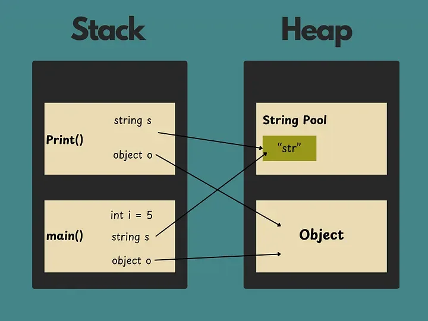
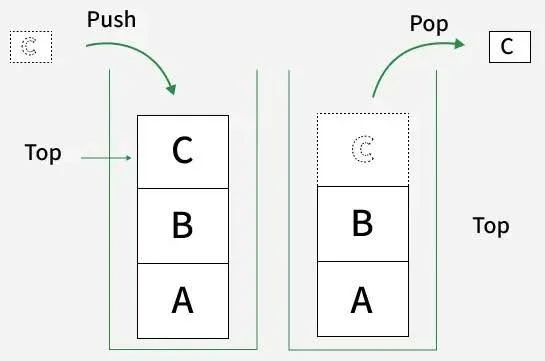
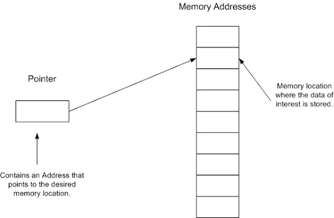
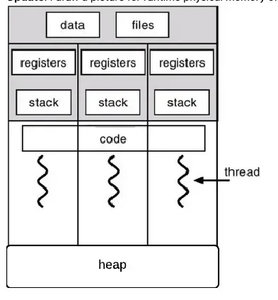

# Malware for Beginners — Phần 1: Stack, heap và calling conventions

**Malware for Beginners:** Phần 1 · [Phần 2 — PE](learning-Malware-for-beginner-part-2.html) · [Phần 3 — Loader](learning-Malware-for-beginner-part-3.html) · [Phần 4 — Shellcode](learning-Malware-for-beginner-part-4.html)

> Nhan_laptop


> ở blog này mình sẽ giới thiệu qua một số khái niệm về malware và hơn hết các thành phần liên quan của một tập file thực thi trên window, từ đó mình có thể thực hành để  khai thác. 
> Vì khá là nhiều kiến thức nên mình sẽ chi ra nhiều section khác nhau. 


## Stack, calling convention - truyền tham số; địa chỉ trả về, bảo toàn thanh gi, stdcall. 

khi nhắc đến bộ nhớ trên RAM ta đều nhớ về  2 loại vùn nhớ quan trọng được máy tính sử dụng trong quá trình chạy: 
- stack
- heap




### stack 

Stack là vùng nhớ lưu các biến local, thông số hàm - function parameters, và thông tin về function call (như là return addresses). 

Stack hoạt động theo LIFO: last in, first out ( như stack trong data structure ).



Call stack là kiểu dữ liệu theo dõi của function calls. Mỗi lần một hàm được gọi , một `stack frame` được đẩy vào stack. Khi thoát khỏi hàm, stack frame popped off. 

Dữ liệu trên stack chỉ hiện trong quá trình hàm chạy. 

Stack mở rộng và thu hẹp tự động với lời gọi hàm và trả về. 

Con trỏ - Pointers là biến, nó lưu trữ địa chữ của bộ nhớ. 



Khi một lời gọi hàm trả về, tất của các biến stack được hủy và con trỏ stack được di về. 

Bạn không buộc phải tự giải phóng bộ nhớ stack, như heap. 

Bạn có thể dùng con trỏ stack để  phân bổ lại vị trí dữ liệu, nhưng nếu bạn trả một con trỏ tới biến local từ một hàm, nó sẽ không hợp lệ sau khi hàm trả vè - kết thúc.

stack có một size nhất định, được quy định bởi ÓS ( thường thì tầm vài trăm KBs tới vài MBs trên một tiến trình/chương trình). 

Stack overflow diễn ra khi một chương trình dùng nhiều bộ nhớ stack hơn nó có sẵn. 


### Heap 

Heap là một vùng nhớ lớn được sử dụng đề cấp phát động với các dữ liệu mà kích cỡ hoặc thời gian suất hiện không được biết trong quá trình chạy. 

Bạn có thể tự cấp phát bộ nhớ trên heap, bằng cách dùng `malloc/free`

Một vòng đời của dữ liệu trên heap được kiểm soát bởi người lập trình ( hoặc garbage collector, đối với các ngôn ngữ có cơ chế qunar lý bộ nhớ tự động).

Heap sẽ lớn hơn về kích thước so với stack. Điển hình, các đối tượng, cấu trúc dữ liệu lớn ( như mảng, danh sách liên kết), và bất kể các dữ liệu nào mà bạn muốn chia sẽ giữa các hàm hoặc tồn tại lâu hơn mọt lần gọi hàm thì được lưu trong heap. 

Với mỗi thread có riêng nó một stack nhưng heap thì share chung cho các thread. 



### Calling convetion - truyền tham số; đại chỉ trả về, bảo toàn thanh ghi , stdcall. 

Trong ngôn ngữ C/C++, calling convetion được định nghĩa là một tập các luật lệ, nó xác định cách thức một hàm sẽ được gọi. Bạn có thể nhìn thấy các từ khóa như `__cdecl` hoặc `__stdcall` khi bạn gặp lỗi liên quan đến liên kết (linking errors).


#### Caller và callee?

khi chúng ta gọi một hàm, một stack frame sẽ được cấp phát cho hàm đó, các tham số sẽ được truyền cho hàm, và sau đó hàm làm việc của nó xong, stack frame đã được cấp phát bị giải phóng và quyền điều khiển bị truyền cho calling function. 

Hàm được chương trình con được gọi là hàm gọi - caller. Hàm được gọi bởi caller được gọi là callee. 


#### Calling convention 
 
Calling convention trong C/C++ là các hướng dẫn, quyết định: 

- Cách mà các tham số - arguments được chuyển sang stack.  
- Ai sẽ là người dọn dẹp các stack, caller, callee.
- Registers nào được dùng và cách dùng. 

#### Các loại Calling Conventions 

Có nhiều loại calling conventions tùy thuộc vào các platforms khác nhau. Chúng ta sẽ làm quen với 32-bit x86 calling conventions: 
- `__cdecl`
- `__stdcall`
- `__fastcall`
- `__thiscall` (C++ only )

1. `__cdecl`

`__cdecl` calling convention là calling convention mặc định trong C/C Trong calling convention này: 
- Các tham số được đẩy từ phải sang trái ( để các tham số đầu tiên gần với đỉnh stack nhất).
- Caller dọn dẹp stack. 
- Tạo ra các tệp thực thi lớn hơn so với `__stdcall`, do mỗi lời gọi hàm cần bao gồm mã dọn dẹp stack. 

2. `__stdcall`
Đây là calling convetion riêng của Microsoft được dùng trong hàm Win32 API, ở convetion này: 
- Các tham số được đẩy từ phải sang trái. 
- Callee sẽ dọn dẹp stack. 

3. `__fastcall`

Trong `__fastcall` calling convention, các tham số được chuyển vào thanh ghi nếu có thể. 
- 2 tham số đầu tiên được chuyển vào thanh gi ECX và EDX. Các tham số còn lại được chuyển vào stack từ phải qua trái. 
- Callee sẽ dọn stack. 

4. `__thiscall`

`__thiscall` calling convetnion là calling convention mặc định được gọi bởi method bên trong class. Đó là lí do vì sao chỉ trong C++ mới có thể gọi còn C thì không: 
- Các tham số được đầy vào stack từ phải sang trái. 
- con trỏ `this` được chuyển vào thanh ghi ECX, và không trên stack. 
- vì ta chuyển con trỏ `this` này, nên khoogn thể sử dụng quy ước gọi hàm này cho các hàm không phải là hàm thành viên.  
- Callee dọn dẹp stack. 

#### Địa chỉ trả về, bảo toàn thanh ghi . 

##### Địa chỉ trả về

Một `return address` là một vị trí bộ nhớ xác định điểm trong chương trình mà tại đó quyền điều khiển nên dược trả về sau khi hàm thực thi. Đây là thành phần qua trọng trong stack, được sử dụng để xử lý lỗi và điều khiển luồng chương trình 

Nằm trên stack ngay sau khi lệnh CALL được thực thi (lệnh CALL đẩy địa chỉ của lệnh kết tiếp vào stack). Lệnh RET sẽ pop địa chỉ này vào thanh ghi `EIP/RIP` để tiếp tục luồng thực thi của chương trình. 

##### Bảo toàn thanh ghi

trước hết ta cần điểm qua các thanh ghi quan trọng và chức năng của nó, mục đích sử dụng tổng quan cảu registers: 


| Registers | Tên | Chức năng chính |
| -------- | -------- | -------- |
| EAX     | accumulater     | khởi tạo toán cục, chứ giá trị trả về- return value của hàm     |
| ECX     | Counter     | làm biến đếm vòng lặp (loop), dùng để chứa con trỏ `this` (`__thiscall`) hoặc tham số 1 (`__fastcall`)     |
|  edx | data   | hỗ trợ phép nhân/chia lớn, chứa tham số 2 trong `__fastcall` |
|  ebx | base   | thanh ghi lưu trữ dữ liệu chung callee-saved |
| esp | stack pointer  | luôn trỏ vào đỉnh stack. Thay đổi liên tục khi pushs,pop,call,ret |
| ebp | base pointer  | trỏ vào gốc của stack frame hiện tại. Dùng làm mốc cố định để truy cập tham số và biến local ([ebp + x],[ebp-x]) |
| edi  | destination index  | con tỏ đihcs vào các thao tác chuỗi mảng (movsd, stosb) |
|eip  | instruction pointer | con trỏ lệnh - trỏ tới địa chỉ của lệnh assem tiếp theo được cpi thực thi (thanh ghi quan trọng nhất khi hijack luồng chạy) |

ví dụ với đoạn mã: 
```go
int __fastcall DecryptPayload(char* src, char* dst, int length) {
    int count = 0;
    for (int i = 0; i < length; i++) {
        dst[i] = src[i] ^ 0x5A;
        count++;
    }
    return count; 
}
```

assembly: 

```go
; =========================================================================
; PROLOGUE: Thiết lập Stack Frame
; =========================================================================
0x00401000  push ebp             ; Lưu EBP cũ của Caller vào Stack
0x00401001  mov  ebp, esp        ; EBP = Đáy (Base Pointer) cố định của Stack Frame mới
0x00401003  sub  esp, 0x08       ; ESP nhích xuống để tạo không gian cho biến local (count, i)

; =========================================================================
; TRUYỀN THAM SỐ (__fastcall) & CHUẨN BỊ LẶP
; ECX = src (tham số 1), EDX = dst (tham số 2), [ebp+8] = length (tham số 3 trên stack)
; =========================================================================
0x00401006  mov  esi, ecx        ; ESI = src (Con trỏ nguồn: trỏ vào chuỗi bị mã hóa)
0x00401008  mov  edi, edx        ; EDI = dst (Con trỏ đích: trỏ vào vùng nhớ chứa kết quả)
0x0040100A  mov  ecx, [ebp+0x08] ; ECX = length (Đưa độ dài vào làm Counter cho vòng lặp)
0x0040100D  xor  ebx, ebx        ; EBX = 0 (Dùng EBX làm biến đếm count, gán bằng 0)

; =========================================================================
; LOOP: Giải mã chuỗi
; =========================================================================
DECRYPT_LOOP:
0x0040100F  mov  al, [esi]       ; AL (8-bit thấp của EAX) = lấy 1 byte từ ESI (src)
0x00401011  xor  al, 0x5A        ; AL = AL ^ 0x5A (XOR byte đó với key)
0x00401013  mov  [edi], al       ; Lưu byte đã giải mã vào vị trí EDI (dst)
0x00401015  inc  esi             ; ESI++ (Nhích con trỏ nguồn sang byte tiếp theo)
0x00401016  inc  edi             ; EDI++ (Nhích con trỏ đích sang byte tiếp theo)
0x00401017  inc  ebx             ; EBX++ (count++)
0x00401018  dec  ecx             ; ECX-- (Giảm số lần lặp còn lại)
0x00401019  jnz  DECRYPT_LOOP    ; Nếu ECX != 0 thì nhảy tiếp tục vòng lặp

; =========================================================================
; EPILOGUE: Trả về kết quả & Dọn dẹp Stack
; =========================================================================
0x0040101B  mov  eax, ebx        ; EAX = EBX (Chuyển giá trị count vào EAX làm RETURN VALUE)
0x0040101D  mov  esp, ebp        ; Thu hồi bộ nhớ biến local, ESP khôi phục về vị trí EBP
0x0040101F  pop  ebp             ; Pop lấy lại EBP nguyên bản cho Caller
0x00401020  ret  0x04            ; Nhảy về địa chỉ Return Address, dọn dẹp tham số trên Stack
```

sơ đồ trực quan tịa địa chỉ `0x0040100F`: 
```go
REGISTER STATE AT RUNTIME (x64dbg / Debugger view):
  ===========================================================================
  [ EIP ] = 0x0040100F  ---> [Chỉ vào lệnh "mov al, [esi]" tiếp theo sẽ chạy]
  
  [ EBP ] = 0x0019FF80  ---> [Mốc cố định đáy Stack Frame: dùng để đọc [ebp+8]]
  [ ESP ] = 0x0019FF78  ---> [Đỉnh Stack hiện tại: bị kéo xuống 8 byte để chứa biến local]
  
  [ ESI ] = 0x00403000  ---> [Con trỏ NGUỒN: trỏ tới byte mã hóa '0x1F' trong RAM]
  [ EDI ] = 0x00405000  ---> [Con trỏ ĐÍCH: trỏ tới vùng RAM trống chuẩn bị ghi]
  
  [ ECX ] = 0x0000000A  ---> [Biến đếm COUNTER: còn lại 10 lần lặp]
  [ EBX ] = 0x00000002  ---> [Thanh ghi lưu trữ chung: giữ giá trị count = 2]
  [ EAX ] = 0x00000000  ---> [Đang chuẩn bị nhận giá trị 8-bit AL; sau vòng lặp sẽ chứa Return Value]
  [ EDX ] = 0x00000000  ---> [Sử dụng phụ trợ (hoặc chứa tham số ban đầu)]
  ===========================================================================
```


Trong kiến trúc x86/x64 Windows, CPU chỉ có một số lượng thanh ghi hữu hạn. Để tránh việc các hàm đè dữ liệu của nhau, hệ điều hành và trình biên dịch chia các thanh ghi thành 2 nhóm chính: 

1. Volatile Registers/Caller-saved Registers (Thanh ghi "Caller bảo toàn")
- Khái niệm: Các thanh ghi này có thể bị `Callee` thay đổi tùy ý trong quá trình chạy. 
- Nếu caller muốn giữ lại dữ liệu trong các thanh ghi này sau khi gọi hàm, Caller bắt buộc phải tự push lưu nó vào Stack trước khi gọi, và pop lấy lại sau khi hàm trả về. 
- Các thanh ghi trong x86 (32-bit): eax,ecx,edx. 
    - Eax thường dùng để chứa giá trị return address của hàm. 

2. Non-volatile Registers/ Callee-saved Registers (thanh ghi "Callee bảo toàn")
- Khải niệm: các thanh ghi này chứa dữ liệu quan trọng trong Caller. Callee được phép dùng, nhưng phải đảm bảo giá trị của chúng không thay đổi sau khi hàm kết thúc. 
- Nếu callee muốn dùng các thanh ghi này, ngay đầu hàm (Prologue) Callee phải push chúng vào stack, và trước khi hàm ret kết thúc hàm (Epilogue), Callee phải pop để khôi phục lại các gía trị nguyên bản. 
- Các thanh ghi trong x86: ebx, esi, edi,ebp, esp. 

trực quan: 

```go
; --- Prologue đầu hàm callee ---
push ebp            ; lưu ebp của caller
mov ebp, esp        ; thiết lập stack frame mới
push ebx            ; bảo toàn: lưu ebx ban đầu vòa stack - callee-saved 
push esi            ; bảo toàn: lưu esi ban đầu vào stack - callee saved

; --- function body ---

mov ebx, xxxx ; callee dùng thoải mái ebx 
mov esi, xxxx ; callee dùng thoải mái esi 

; --- epilogue cuối hàm callee ---
pop esi             ; khôi phục lấy lại esi ban đầu cho caller 
pop ebx             ; khôi phục lấy lại ebx ban đầu cho caller
mov esp, ebp        ; thu hồi stack frame 
pop ebp             ; khôi phục ebp của caller 
ret                 ; return address hàm trước đó 
```

Bảo toàn thanh ghi:
- Caller-saved (EAX,ECX,EDX): caller tự giữ, callee dùng thoải mái. 
- Callee-saved (ebx,esi,edi,ebp,esp): callee bắt buộc phải push trong stack trước khi dùng và pop để lấy ra. 


## references

- 1. https://towardsdev.com/understanding-stack-and-heap-memory-a96e90f9c982
- 2. https://www.geeksforgeeks.org/cpp/calling-conventions-in-c-cpp/
- 3. https://thecodest.co/en/dictionary/return-address/
- 4. https://en.wikipedia.org/wiki/X86_calling_conventions#Register_preservation
- 5. https://www.geeksforgeeks.org/computer-organization-architecture/general-purpose-registers/