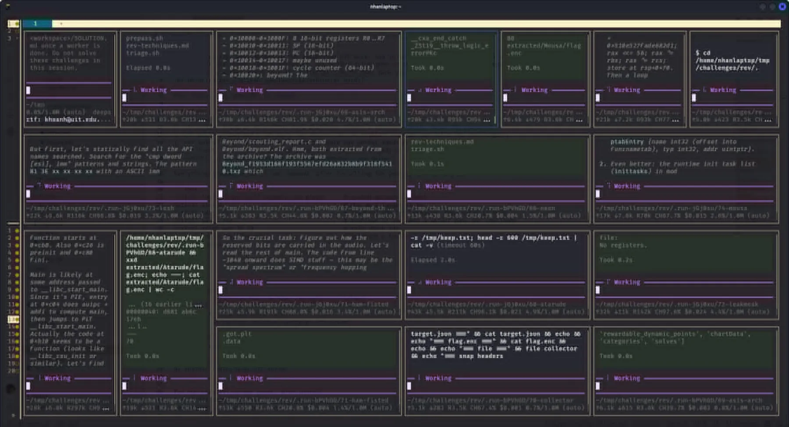
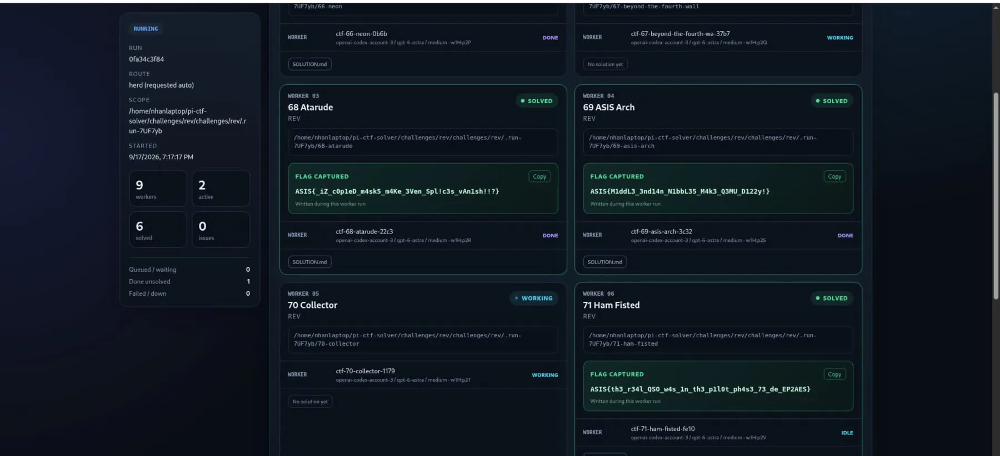

# [Project] pi-ctf-solver — CTF Automation as a Pi Package

Most of a CTF category is not the challenge. It is logging in, finding the download button, unpacking three nested archives, reading a description that arrived as HTML, and writing a brief that a solver agent can actually start from. That overhead repeats for every challenge, and it is the part that costs the first ten minutes of a category you have already decided to attack.

`pi-ctf` is a [pi](https://pi.dev) package that deletes that stage. You log in to a platform once, name a category, and the package downloads every challenge into its own workspace, writes a brief for each one, and delegates them to worker agents that run in parallel. It is published on npm as [`pi-ctf`](https://www.npmjs.com/package/pi-ctf) and the source is on [GitHub](https://github.com/Nhan-Laptop/pi-ctf-solver), with MIT licensing.

This post is about how the pieces fit together: what the tool surface looks like, what happens during a run, how delegation degrades gracefully, and what the measurements actually say.

## What the package is

The whole surface is deliberately small — four tools and two slash commands, with no persistent daemon:

| Surface | Purpose |
| --- | --- |
| `ctf_login` | Log in to a CTFd/Laravel form, noCTF, or CTFd API-token platform, or read a public archive; stores a confirmed session, never the password or token |
| `ctf_pull` | Download a category (or chosen ids) so the current session can solve the challenges itself |
| `ctf_solve` | Download a category and delegate one worker per challenge, with optional orchestrator-side submission |
| `ctf_local` | Delegate challenge directories that are already on disk |
| `/ctfctl` / `/ctfctf` | The same surface as slash commands, including the checker and logout |

In practice a run looks like this:

```text
/ctfctl login https://ctf.example.com player     # masked password prompt
/ctfctl solve rev                                # download it and open a worker pane per challenge
/ctfctl solve web --dashboard                    # watch every worker and recovered flag live
/ctfctl solve web --submit                       # orchestrator submits each fresh FLAG.txt
/ctfctl local rev ./my-pack --dry-run            # read-only plan, nothing written
/ctfctl checker watch                            # new FLAG.txt files post themselves to the session
```

Two design choices stand out. First, `pull` and `solve` are separate: sometimes you want the files in front of you rather than an army of panes. Second, submission is orchestrator-owned and opt-in — a worker never holds the platform session, so a worker cannot leak or misuse it.

## Anatomy of a run

**Login.** `auth.ts` and `session.ts` implement the credential model: form login for CTFd/Laravel, JSON login for noCTF, an API-token path, and static-archive detection for finished CTFs. The password or token is read from `CTFCTL_PASSWORD`/`CTFCTL_TOKEN` or typed into a masked prompt (`secret.ts`), and the session is only persisted after the platform confirms the identity — stored `0600`, outside the repository. Errors are redacted before they reach a log.

**Pull.** `workspace.ts` creates one directory per challenge and fills it atomically: the attachments, a `README.md` brief rendered from the platform description (`html.ts` keeps the conversion conservative), a `challenge.json` sidecar, and — for rev, pwn, and misc — a `.revtools` bundle of bounded triage helpers. Downloads are atomic so an interrupted pull never leaves a half-written challenge that a worker would happily “solve”.

**Delegate.** `delegate.ts` picks the best available runtime. Inside [Herdr](https://herdr.dev) with [pi-herdr](https://github.com/YunosukeYoshino/pi-herdr) installed, it opens a visible pane per challenge. Without it, the extension falls back to emitting `herd_spawn` calls for `pi-herdr`, and failing that, to isolated headless workers with a concurrency limit. The same command therefore works on a laptop with panes and on a headless box with neither.

**Verify and submit.** Workers drop a `FLAG.txt` when they are done; `submit.ts` watches for *fresh* flags, deduplicates them, and keeps durable submission state so a restart does not double-submit. `checker` reports every flag under the workspace as JSON and can keep watching.

**Observe.** `dashboard.ts` is an opt-in, tokenized loopback web UI with server-sent events: run scope, per-worker phase, artifacts, and the captured flag as it lands. It is ephemeral — it lives for the Pi session and never binds beyond loopback.

Two more modules handle the failures you only notice in long runs. `watchdog.ts` detects a worker that has stalled rather than worked, and `handoff.ts` writes a controlled `PROGRESS.md` so a replacement model can pick up the same session after the primary window (five minutes by default) expires.

## What it looks like

One worker pane per challenge, all started within milliseconds of each other, so the category is a parallel race rather than a queue:



The dashboard turns that into a single view: run scope, worker count, solved and failed totals, and each recovered flag:



A two-minute unedited demo of the parallel run:

<video controls preload="metadata" poster="../../assets/pi-ctf/panes.webp">
    <source src="../../assets/pi-ctf/demo.mp4" type="video/mp4">
    Your browser does not support the embedded video tag.
</video>

## What the measurements say

The repository keeps its benchmark documents in `docs/`, and the numbers come from real platforms, not simulations.

The crypto sweep is the clearest one. Every offline ASIS crypto challenge was run with one worker each, first as a baseline, then after adding deterministic triage and per-command time budgets:

| run | workers | solved in budget | median agent → flag | wall clock | serial sum of all solves |
| --- | ---: | ---: | ---: | ---: | ---: |
| baseline | 6 | 1 | 242.9 s | 1200 s | 5451.1 s |
| optimized | 5 | **5** | 590.5 s | **909.9 s** | 3029.9 s |

The second run solved 5/5 and verified 5/5, while the same five solves would have cost 3029.9 s if executed one after another — a **3.33× parallel gain**, with the whole offline category finished inside 15 minutes of wall clock. The run audit is what produced the improvement: the baseline lost challenges to single commands that ran for 1000–3600 seconds, so the fix was a hard budget per command rather than a better prompt.

Login was measured separately against a noCTF static archive and an ASIS Laravel + Cloudflare deployment. Reworking the HTTP layer (`http.ts`: keep-alive, retry, explicit timeouts, folded `Set-Cookie`) moved the ASIS form login to a best case of 2018 ms / mean 2045 ms, with 516 ms / 540 ms after the Enter keystroke. The archive path sends no credential at all. A transient `ETIMEDOUT` against both Cloudflare addresses, caught during the benchmark, became the page-probe retry in the shipping code — which is the point of keeping the loop in the repository.

## Skills, and the two-interpreter problem

Installing the package also registers the `ctf-*` skills: `ctf-core` plus one playbook per category (`crypto`, `web`, `pwn`, `rev`, `forensics`, `misc`, `osint`). They are distilled from hands-on competition work, and `ctf-crypto` ships reference briefs and repos on top of the playbook. The skills are what make a worker reason about a challenge family instead of improvising.

Dependencies are declared per skill in `requirements.txt`, and there is a real trap documented there: two interpreters are involved and they are not interchangeable. `sage -c` is the only one with `fpylll`, `numpy`, `sympy`, `gmpy2`, and `igraph`; plain `python3` carries `Crypto`, `cryptography`, `z3`, `pwn`, `Pillow`, `capstone`, `elftools`, and `lief`. In some builds `sage -python` does not exist at all, so the `[sage]` entries have to be installed with the Sage environment's own interpreter.

`scripts/check-tools.sh` reads `requirements.txt` literally and imports every module for real, so the preflight cannot rot silently: a missing required module fails, an optional one is reported, and a batch that cannot run is reported as `unverified` rather than as a plain absence. When a row has to be proven on its own, `--verify-isolated` re-checks exactly those entries in fresh processes, and `--isolate-failed` attributes a broken batch to the entries responsible while the overall run still fails.

## Boundaries I kept

- **Authorized use only.** Competitions and wargames where automated tooling, target traffic, and local analysis are expressly permitted.
- **No sandbox claim.** Extension code and worker agents run with full user permissions. The tooling is careful, not isolated — challenges you are unwilling to execute locally should not be run.
- **Reads by default.** The platform client reads by default; submission is a separate, explicit API surface that only the orchestrator uses.
- **Bounded reads.** `artifacts.ts` reads workspace artifacts without following symlinks and within size limits, so a hostile challenge cannot turn a status call into an arbitrary file read.
- **Secrets never persist.** Passwords and tokens are never written to disk; only a confirmed session is, at `0600`.

## Current state

`pi-ctf` is at `0.1.1` and early-stage. The category pipeline, delegation, dashboard, submission monitor, handoff, and preflight are working and measured; the skills are the part most worth contributing to. A missing crypto, rev, or forensics tool degrades one category rather than blocking the extension, and every worker is told which interpreter actually holds the Sage stack.

If you want to try it:

```bash
pi install npm:pi-ctf        # latest stable release
pi -e npm:pi-ctf             # try it for one run without installing
```

For parallel panes, install [pi-herdr](https://github.com/YunosukeYoshino/pi-herdr) and run pi inside a Herdr pane.

## Links

- [pi-ctf on npm](https://www.npmjs.com/package/pi-ctf) · [Pi package details](https://pi.dev/packages/pi-ctf)
- [Nhan-Laptop/pi-ctf-solver](https://github.com/Nhan-Laptop/pi-ctf-solver) — source, skills, tools, and the benchmark documents in `docs/`
- [Herdr](https://herdr.dev) · [pi-herdr](https://github.com/YunosukeYoshino/pi-herdr) · [pi-web-access](https://github.com/nicobailon/pi-web-access) for documentation-only web access
