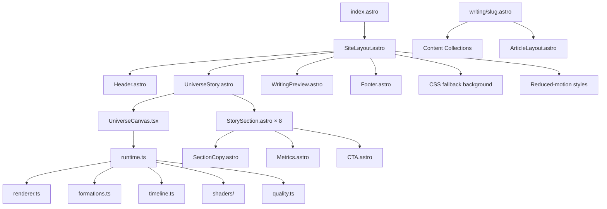

# Kimi K3–Style Scroll-Driven Universe Blog Rebuild Specification

## 0. Mục đích tài liệu

Tài liệu này là đặc tả triển khai dành cho một AI coding agent hoặc developer, nhằm xây dựng lại một blog có trải nghiệm **scroll-driven universe animation** lấy cảm hứng từ website xuất hiện trong video Kimi K3.

Mục tiêu không phải sao chép nội dung thương hiệu, mà là tái tạo:

- Nhịp kể chuyện theo scroll.
- Canvas WebGL cố định toàn màn hình.
- Hàng nghìn voxel/particle morph giữa nhiều formation.
- Camera 3D chuyển động xuyên suốt.
- Typography tối giản, content-first.
- Dark mode mặc định.
- Cảm giác gần với phong cách Lee Robinson.
- Kiến trúc Astro Islands tối ưu hiệu năng.
- Fallback HTML/CSS hoạt động khi JavaScript hoặc WebGL không khả dụng.

---

## 1. Tài nguyên đầu vào

### Video tham chiếu

```text
/mnt/data/6008212265660514446.mp4
```

### Keyframe tổng hợp

```text
/mnt/data/kimi_keyframes_contact.png
```

### Lưu ý

Các timing, duration, easing và thư viện được ghi trong tài liệu là **ước lượng kỹ thuật dựa trên video**. Không thể xác nhận source code hoặc thư viện gốc chỉ từ video.

---

## 2. Mục tiêu sản phẩm

Xây dựng một blog cá nhân có homepage dạng interactive scrollytelling:

```text
Loader
→ Compact particle cloud
→ Flowing data ribbons
→ Layered voxel structure
→ Compute swarm
→ Connected system clusters
→ Sparse universe field
→ Adaptive terrain
→ Final diamond formation
→ Writing list
```

Phần animation 3D chỉ nên tập trung ở homepage.

Các trang bài viết phải:

- Ưu tiên khả năng đọc.
- Không phụ thuộc WebGL.
- Có typography sạch.
- Có width đọc khoảng 680–760px.
- SSR/SSG đầy đủ.
- Hỗ trợ SEO, RSS và sitemap.

---

# 3. Phân tích website gốc theo timestamp

## 3.1. `00:00–00:01.8` — Loading state

### Quan sát

- Background gần như đen tuyệt đối.
- Glyph nhỏ bằng các ô vuông ở giữa.
- Progress number tăng đến `100`.
- Glyph pulse nhẹ.
- Website chưa hiển thị scene chính.

### Animation ước lượng

| Thành phần | Timing |
|---|---:|
| Loader tổng | 1.5–1.8s |
| Progress | Linear |
| Glyph pulse | 500–800ms |
| Loader fade-out | 250–400ms |
| Fade easing | `cubic-bezier(0.16, 1, 0.3, 1)` |

### Yêu cầu tái tạo

Loader chỉ chờ:

- Dynamic import Three.js hoàn tất.
- Shader compile hoàn tất.
- Formation đầu tiên sẵn sàng.
- Canvas render được frame đầu tiên.

Hero heading vẫn phải được SSR và không bị loader che vô thời hạn.

---

## 3.2. `00:01.8–00:04.5` — Compact intelligence cloud

### Quan sát

- Voxel cloud nhỏ xuất hiện ở giữa.
- Màu tím, xanh, xám, vàng nhạt.
- Orbital ellipse bao quanh object.
- Camera dolly-in.
- Text reveal từng dòng.

### Animation

```text
Loader disappears
→ Cloud scales from 0.1 to 1
→ Particle opacity rises
→ Orbital lines draw in
→ Camera dollies closer
→ Text lines reveal
```

### Timing ước lượng

| Thành phần | Timing |
|---|---:|
| Cloud entrance | 700–1000ms |
| Text stagger | 60–90ms |
| Orbit draw | 900–1200ms |
| Camera | Scroll-scrubbed |

---

## 3.3. `00:04.5–00:07.8` — Flowing raw material ribbons

### Quan sát

Particle cloud biến thành nhiều ribbon cong:

- Dải xanh/tím phía trên.
- Dải xanh/vàng phía dưới.
- Dải cam nhỏ.
- Camera pan và orbit nhẹ.

### Morph

```text
Dense cloud
→ Curved ribbon formation
→ Ribbons separate vertically
```

### Scroll behavior

```js
scrub: 0.6
ease: "none"
```

---

## 3.4. `00:07.8–00:10.4` — Ribbon aggregation

### Quan sát

- Các ribbon thu lại.
- Voxel hình thành slab hoặc layered block.
- Camera hạ góc.
- Một glow nhỏ xuất hiện ở bên phải.

### Morph

```text
Curved ribbons
→ Flattened streams
→ Layered voxel block
```

Không được dissolve object rồi tạo object mới. Phải morph trực tiếp giữa hai formation.

---

## 3.5. `00:10.4–00:13.2` — Layered system structure

### Quan sát

- Khối voxel giống hạ tầng compute hoặc thành phố dữ liệu.
- Cube có nhiều kích thước.
- Camera tiến gần.
- Sau đó object bắt đầu phân rã.

### Text animation

```css
opacity: 0 → 1;
transform: translateY(12px) → translateY(0);
filter: blur(5px) → blur(0);
```

---

## 3.6. `00:13.2–00:17.8` — Compute swarm

### Quan sát

- Khối voxel nổ thành một cloud lớn.
- Màu cam/nâu nổi bật.
- Nhiều orbital lines cắt qua cloud.
- Voxel gần camera lớn hơn rõ rệt.
- Metrics xuất hiện bên trái.

### Kỹ thuật đề xuất

```text
InstancedBufferGeometry
Custom ShaderMaterial
PerspectiveCamera
CatmullRomCurve3 / EllipseCurve
GSAP ScrollTrigger
```

### Animation

- Cloud xoay chậm quanh trục Y.
- Camera bay xuyên gần object.
- Orbit lines có tốc độ riêng.
- Metrics reveal theo stagger.
- Scale cube phụ thuộc depth.

---

## 3.7. `00:17.8–00:20.0` — Connected capability network

### Quan sát

- Cloud chuyển thành nhiều cluster màu.
- Cluster trung tâm trắng/xám.
- Cluster phụ xanh, tím, cam và đỏ.
- Các nhóm sắp xếp quanh hub trung tâm.

### Morph

```text
Compute cloud
→ Particles separate by group/color
→ Colored clusters form
→ Clusters stabilize around central hub
```

---

## 3.8. `00:20.0–00:24.9` — Autonomous universe field

### Quan sát

- Cluster phân tán.
- Camera đi xuyên vào trường hạt.
- Mật độ voxel giảm.
- Scene tối hơn.
- Particle nhỏ giống starfield.

### Background

- Starfield tối.
- Nebula rất nhẹ.
- Điểm đỏ, xanh, tím.
- Depth parallax.
- Không có aurora lớn.

---

## 3.9. `00:24.9–00:29.0` — Sparse action field

### Quan sát

- Particle thưa.
- Một số điểm sáng chuyển động độc lập.
- Metrics xuất hiện.
- Camera drift chậm.
- Đây là đoạn nghỉ nhịp.

### Metrics animation

```text
Label
→ Number
→ Unit
```

Có thể dùng count-up 500–700ms, nhưng phải tắt khi reduced-motion.

---

## 3.10. `00:29.0–00:33.3` — Adaptive terrain

### Quan sát

- Particle xanh/vàng tạo thành mặt phẳng.
- Trung tâm nâng lên.
- Voxel trắng kết tụ thành mound/pillar.
- Camera thấp, nhìn ngang qua bề mặt.
- Glow tím nhỏ ở foreground.

### Height field gợi ý

```js
height =
  gaussian(distanceToCenter) *
  progress *
  noise(x, z);
```

---

## 3.11. `00:33.3–00:39.7` — Final diamond CTA

### Quan sát

- Voxel trắng/xám hình thành khối kim cương.
- Object nghiêng khoảng 35–45 độ.
- Text và CTA nằm bên trái.
- Scene dừng ở trạng thái hero cuối.

### Animation

```text
Ground field contracts
→ Particles rise
→ Cubes snap toward diamond formation
→ Camera pulls back
→ Heading reveals
→ CTA reveals
→ Diamond enters slow idle motion
```

### Timing ước lượng

| Thành phần | Timing |
|---|---:|
| Ground → diamond | 2.0–2.8s theo scroll |
| Heading reveal | 600–750ms |
| CTA delay | 120–180ms |
| Idle rotation | 35–60s/revolution |
| Idle float | 4–6s |

---

# 4. Các animation không thể xác nhận từ video

## 4.1. Hover effects

Video không cho thấy pointer hover.

Bản tái tạo chỉ nên dùng micro-interaction nhẹ:

```text
Text link:
- color: 180ms
- underline scale-x: 220ms

CTA:
- background: 180ms
- border: 180ms
- translateY(-1px)

Article row:
- title color/opacity
- arrow translateX(3px)
```

Không thêm magnetic cursor hoặc exaggerated 3D tilt ở bản đầu.

---

## 4.2. Page transitions

Không thấy route transition trong video.

Dùng transition nhẹ:

```text
Old page opacity: 1 → 0
New page opacity: 0 → 1
Duration: 180–240ms
```

---

## 4.3. Text animations

Ưu tiên:

- Opacity.
- TranslateY nhỏ.
- Blur ngắn.
- Stagger nhẹ.
- Không dùng character scramble trừ loader hoặc label nhỏ.

---

# 5. Phân tích background

## 5.1. Cấu trúc đề xuất

```text
Base: #050505
Vignette: black radial
Radial glow: purple/blue, opacity thấp
Ambient dust: tiny particles
Scene glow: inside WebGL
Optional floor grid: only selected scenes
Film grain: extremely subtle
```

## 5.2. Không nên lạm dụng

- Glassmorphism card lớn.
- Backdrop blur dày.
- Aurora gradient nhiều màu.
- Liquid gradient.
- Fullscreen chromatic aberration.
- Heavy bloom.

## 5.3. CSS base background

```css
.universe-background {
  background:
    radial-gradient(
      70% 55% at 72% 72%,
      rgb(78 53 122 / 12%),
      transparent 70%
    ),
    radial-gradient(
      50% 45% at 42% 38%,
      rgb(49 68 112 / 9%),
      transparent 75%
    ),
    #050505;
}
```

---

# 6. Stack công nghệ bắt buộc

## 6.1. Astro

Sử dụng:

- Astro SSG/SSR cho toàn bộ content.
- Astro Content Collections cho bài viết.
- Astro Islands cho WebGL.
- Chỉ hydrate những component thực sự cần JavaScript.

## 6.2. Tailwind CSS

Sử dụng:

- Design tokens.
- Utility-first responsive layout.
- Custom keyframes.
- Dark mode default.
- CSS-first fallback.

## 6.3. Three.js

Sử dụng cho:

- Instanced voxel cubes.
- GPU morphing.
- Camera.
- Orbital lines.
- Particle field.
- Shader-based color interpolation.
- Optional low-cost bloom.

## 6.4. GSAP + ScrollTrigger

Sử dụng cho:

- Scroll progress.
- Scene boundaries.
- Camera interpolation.
- Text reveal coordination.
- Pinning hoặc sticky scene control.
- Reverse scroll consistency.

## 6.5. Native HTML/CSS

Sử dụng cho:

- SSR content.
- CSS scroll-driven text animation.
- Static background fallback.
- Reduced-motion fallback.
- Navigation.
- Writing list.
- Article pages.

## 6.6. Không dùng Framer Motion làm engine chính

Framer Motion không cần thiết cho:

- Shader uniforms.
- Camera path.
- Hàng nghìn voxel.
- Timeline WebGL toàn trang.

Có thể dùng cho UI React riêng biệt, nhưng không phải dependency bắt buộc.

---

# 7. Lee Robinson–inspired design rules

## 7.1. Visual rules

- Dark mode mặc định.
- Content-first.
- Heading lớn nhưng không quá trang trí.
- Body copy sạch, width vừa phải.
- Monospace cho metadata.
- Borders mảnh.
- Khoảng trắng rộng.
- Hover tinh tế.
- Không dùng quá nhiều card.
- Không làm toàn bộ site thành tech demo.

## 7.2. Homepage

```text
Interactive universe hero
→ Short profile/introduction
→ Selected writing
→ Projects/research
→ Footer
```

## 7.3. Article pages

- Không WebGL.
- Max-width đọc: `44rem`.
- Typography rõ.
- Code blocks dễ đọc.
- Table of contents nhẹ.
- Transition route rất ngắn.
- Không pin hoặc smooth scroll bắt buộc.

---

# 8. Component architecture



---

# 9. Folder structure

```text
src/
├── components/
│   ├── home/
│   │   ├── UniverseStory.astro
│   │   ├── UniverseCanvas.tsx
│   │   ├── StorySection.astro
│   │   ├── SectionCopy.astro
│   │   └── Metrics.astro
│   ├── writing/
│   │   ├── WritingList.astro
│   │   └── WritingRow.astro
│   └── ui/
│       ├── Header.astro
│       ├── Button.astro
│       └── Footer.astro
├── layouts/
│   ├── SiteLayout.astro
│   └── ArticleLayout.astro
├── lib/
│   └── universe/
│       ├── runtime.ts
│       ├── renderer.ts
│       ├── formations.ts
│       ├── formation-worker.ts
│       ├── timeline.ts
│       ├── quality.ts
│       ├── camera-states.ts
│       ├── palettes.ts
│       └── shaders/
│           ├── voxel.vert.glsl
│           └── voxel.frag.glsl
├── pages/
│   ├── index.astro
│   └── writing/
│       └── [...slug].astro
├── styles/
│   ├── global.css
│   ├── prose.css
│   └── universe.css
└── content.config.ts
```

---

# 10. Hydration strategy

Canvas ở ngay hero:

```astro
<UniverseCanvas client:load />
```

Các component phụ chỉ hydrate khi cần:

```astro
<ArticleSearch client:idle />
```

Không hydrate:

- Header tĩnh.
- Footer.
- Writing rows.
- Story copy.
- Metrics tĩnh.
- Article content.

---

# 11. Tailwind configuration

Tạo file `tailwind.config.js`:

```js
/** @type {import('tailwindcss').Config} */
export default {
  darkMode: 'class',

  theme: {
    extend: {
      colors: {
        void: {
          950: '#030303',
          900: '#050505',
          850: '#080808',
          800: '#0c0c0c',
        },

        ink: {
          DEFAULT: '#f2f2ef',
          soft: '#c5c5bf',
          muted: '#8d8d86',
          faint: '#5f605c',
        },

        line: {
          DEFAULT: 'rgb(255 255 255 / 0.11)',
          strong: 'rgb(255 255 255 / 0.20)',
        },

        signal: {
          DEFAULT: '#c8ed63',
          bright: '#ddff79',
          dim: '#758b3e',
        },

        nebula: {
          blue: '#6978dd',
          violet: '#8e72cf',
          amber: '#c28b50',
          moss: '#8aac5d',
          rose: '#a75b70',
        },
      },

      fontFamily: {
        sans: [
          'Inter Variable',
          'Inter',
          'ui-sans-serif',
          'system-ui',
          'sans-serif',
        ],

        mono: [
          'Geist Mono',
          'SFMono-Regular',
          'Cascadia Code',
          'Roboto Mono',
          'ui-monospace',
          'monospace',
        ],
      },

      fontSize: {
        'display-xl': [
          'clamp(3rem, 8vw, 7.5rem)',
          {
            lineHeight: '0.92',
            letterSpacing: '-0.065em',
            fontWeight: '540',
          },
        ],

        display: [
          'clamp(2.25rem, 5.8vw, 5.5rem)',
          {
            lineHeight: '0.96',
            letterSpacing: '-0.055em',
            fontWeight: '520',
          },
        ],

        lead: [
          'clamp(1.125rem, 1.8vw, 1.5rem)',
          {
            lineHeight: '1.45',
            letterSpacing: '-0.02em',
          },
        ],

        meta: [
          '0.6875rem',
          {
            lineHeight: '1.4',
            letterSpacing: '0.08em',
          },
        ],
      },

      maxWidth: {
        reading: '44rem',
        content: '72rem',
        wide: '88rem',
      },

      spacing: {
        section: 'clamp(5rem, 12vw, 11rem)',
        gutter: 'clamp(1.25rem, 5vw, 5rem)',
      },

      borderRadius: {
        panel: '1.25rem',
      },

      transitionTimingFunction: {
        expo: 'cubic-bezier(0.16, 1, 0.3, 1)',
        smooth: 'cubic-bezier(0.22, 1, 0.36, 1)',
        standard: 'cubic-bezier(0.2, 0, 0, 1)',
      },

      transitionDuration: {
        180: '180ms',
        240: '240ms',
        600: '600ms',
        900: '900ms',
      },

      keyframes: {
        'fade-up': {
          '0%': {
            opacity: '0',
            transform: 'translate3d(0, 14px, 0)',
            filter: 'blur(5px)',
          },
          '100%': {
            opacity: '1',
            transform: 'translate3d(0, 0, 0)',
            filter: 'blur(0)',
          },
        },

        'fade-in': {
          '0%': { opacity: '0' },
          '100%': { opacity: '1' },
        },

        'pulse-soft': {
          '0%, 100%': {
            opacity: '0.42',
            transform: 'scale(0.96)',
          },
          '50%': {
            opacity: '1',
            transform: 'scale(1.04)',
          },
        },

        orbit: {
          from: { transform: 'rotate(0deg)' },
          to: { transform: 'rotate(360deg)' },
        },

        'grain-shift': {
          '0%, 100%': {
            transform: 'translate3d(0, 0, 0)',
          },
          '20%': {
            transform: 'translate3d(-2%, 1%, 0)',
          },
          '40%': {
            transform: 'translate3d(1%, -2%, 0)',
          },
          '60%': {
            transform: 'translate3d(2%, 2%, 0)',
          },
          '80%': {
            transform: 'translate3d(-1%, -1%, 0)',
          },
        },

        scan: {
          '0%': {
            transform: 'translateY(-120%)',
            opacity: '0',
          },
          '20%': {
            opacity: '0.3',
          },
          '80%': {
            opacity: '0.3',
          },
          '100%': {
            transform: 'translateY(120%)',
            opacity: '0',
          },
        },
      },

      animation: {
        'fade-up':
          'fade-up 700ms cubic-bezier(0.16, 1, 0.3, 1) both',
        'fade-in':
          'fade-in 500ms ease-out both',
        'pulse-soft':
          'pulse-soft 1.6s ease-in-out infinite',
        'orbit-slow':
          'orbit 48s linear infinite',
        'grain-shift':
          'grain-shift 700ms steps(2) infinite',
        scan:
          'scan 2.8s linear infinite',
      },

      backgroundImage: {
        'universe-radial': `
          radial-gradient(
            70% 55% at 72% 72%,
            rgb(78 53 122 / 0.12),
            transparent 70%
          ),
          radial-gradient(
            50% 45% at 42% 38%,
            rgb(49 68 112 / 0.09),
            transparent 75%
          )
        `,

        'hairline-grid': `
          linear-gradient(
            rgb(255 255 255 / 0.035) 1px,
            transparent 1px
          ),
          linear-gradient(
            90deg,
            rgb(255 255 255 / 0.035) 1px,
            transparent 1px
          )
        `,
      },

      backgroundSize: {
        grid: '56px 56px',
      },
    },
  },

  plugins: [],
};
```

---

# 12. Global CSS

```css
@import "tailwindcss";
@config "../../tailwind.config.js";

:root {
  color-scheme: dark;
  background: #050505;
  font-synthesis: none;
  text-rendering: optimizeLegibility;
}

html {
  background: #050505;
  scroll-behavior: auto;
}

body {
  min-height: 100%;
  margin: 0;
  overflow-x: clip;
  background: #050505;
  color: #f2f2ef;
}

::selection {
  background: rgb(200 237 99 / 28%);
  color: #fff;
}
```

---

# 13. Homepage structure

```astro
---
import SiteLayout from '../layouts/SiteLayout.astro';
import Header from '../components/ui/Header.astro';
import UniverseCanvas from '../components/home/UniverseCanvas';
import StorySection from '../components/home/StorySection.astro';
import WritingPreview from '../components/writing/WritingPreview.astro';

const scenes = [
  {
    id: 'manufactured',
    eyebrow: 'Origin',
    title: 'Intelligence is not discovered. It is manufactured.',
  },
  {
    id: 'raw-material',
    eyebrow: 'Material',
    title: 'Every intelligent system begins with raw material.',
  },
  {
    id: 'models',
    eyebrow: 'Models',
    title: 'Models do not operate alone.',
  },
  {
    id: 'compute',
    eyebrow: 'Compute',
    title: 'Compute is converted into capability.',
  },
  {
    id: 'autonomous',
    eyebrow: 'Systems',
    title: 'From models to autonomous systems.',
  },
  {
    id: 'actions',
    eyebrow: 'Scale',
    title: 'One system. Millions of intelligent actions.',
  },
  {
    id: 'learning',
    eyebrow: 'Evolution',
    title: 'The product improves while it operates.',
  },
  {
    id: 'factory',
    eyebrow: 'Build',
    title: 'Build the universe behind your ideas.',
  },
];
---

<SiteLayout title="Writing and Research">
  <Header />

  <main>
    <section
      class="relative isolate bg-void-900"
      data-universe-story
    >
      <div
        class="pointer-events-none fixed inset-0 z-0"
        aria-hidden="true"
      >
        <div class="absolute inset-0 bg-universe-radial"></div>

        <UniverseCanvas client:load />
      </div>

      <div class="relative z-10">
        {
          scenes.map((scene, index) => (
            <StorySection
              scene={scene}
              index={index}
            />
          ))
        }
      </div>
    </section>

    <WritingPreview />
  </main>
</SiteLayout>
```

Mỗi `StorySection` nên cao khoảng `130vh–180vh`.

---

# 14. Formation system

## 14.1. Các formation bắt buộc

```text
formation[0] = compact cloud
formation[1] = flowing ribbons
formation[2] = layered block
formation[3] = compute swarm
formation[4] = connected clusters
formation[5] = sparse universe field
formation[6] = adaptive terrain
formation[7] = final diamond
```

## 14.2. Data structure

```ts
export type Formation = Float32Array;
// count * 3 values: x, y, z
```

Mỗi voxel/instance cần:

```text
aFrom
aTo
aColorFrom
aColorTo
aScale
aSeed
aGroup
```

## 14.3. Yêu cầu

- Mọi formation phải có cùng số điểm.
- Dùng seeded random để kết quả ổn định.
- Không recreate toàn bộ geometry khi chuyển scene.
- Không tạo hàng nghìn `THREE.Mesh`.
- Morph trên GPU.
- Precompute formation build-time hoặc worker.
- Cố gắng matching điểm gần nhau để giảm crossing.

## 14.4. Matching strategies

Ưu tiên theo thứ tự:

1. Spatial sort theo trục.
2. Morton/Z-order.
3. Grid bucketing.
4. Approximate nearest neighbor.
5. Random pairing chỉ dùng cho prototype.

---

# 15. Vertex shader mẫu

```glsl
attribute vec3 aFrom;
attribute vec3 aTo;
attribute vec3 aColorFrom;
attribute vec3 aColorTo;
attribute float aScale;
attribute float aSeed;

uniform float uMorph;
uniform float uTime;
uniform float uScatter;

varying vec3 vInstanceColor;
varying float vDepthFade;

float easeInOut(float t) {
  return t * t * (3.0 - 2.0 * t);
}

void main() {
  float morph =
    easeInOut(clamp(uMorph, 0.0, 1.0));

  vec3 center =
    mix(aFrom, aTo, morph);

  float transitionEnergy =
    1.0 - abs(morph * 2.0 - 1.0);

  vec3 direction =
    normalize(center + vec3(0.001));

  float wave =
    sin(uTime * 0.7 + aSeed * 6.283185) *
    transitionEnergy *
    uScatter;

  center += direction * wave;

  float pulse =
    1.0 +
    sin(uTime * 0.8 + aSeed * 9.0) * 0.05;

  vec3 localPosition =
    position * aScale * pulse;

  vec4 worldPosition =
    modelMatrix *
    vec4(center + localPosition, 1.0);

  vec4 viewPosition =
    viewMatrix * worldPosition;

  vInstanceColor =
    mix(aColorFrom, aColorTo, morph);

  vDepthFade =
    smoothstep(30.0, 3.0, -viewPosition.z);

  gl_Position =
    projectionMatrix * viewPosition;
}
```

---

# 16. Fragment shader mẫu

```glsl
uniform float uOpacity;

varying vec3 vInstanceColor;
varying float vDepthFade;

void main() {
  float edge =
    smoothstep(0.0, 0.15, vDepthFade);

  gl_FragColor =
    vec4(
      vInstanceColor,
      uOpacity * edge
    );
}
```

---

# 17. Scroll controller

```ts
import gsap from 'gsap';
import { ScrollTrigger } from 'gsap/ScrollTrigger';

gsap.registerPlugin(ScrollTrigger);

export function attachUniverseTimeline(
  controller: UniverseController,
) {
  const sections = Array.from(
    document.querySelectorAll<HTMLElement>(
      '[data-scene]',
    ),
  );

  const triggers = sections.map(
    (section, index) =>
      ScrollTrigger.create({
        trigger: section,
        start: 'top top',
        end: 'bottom top',
        scrub: 0.65,
        invalidateOnRefresh: true,

        onEnter: () => {
          controller.prepareSegment(index);
        },

        onEnterBack: () => {
          controller.prepareSegment(index);
        },

        onUpdate: ({ progress }) => {
          controller.setSegmentProgress(
            index,
            progress,
          );
        },
      }),
  );

  return () => {
    triggers.forEach((trigger) => {
      trigger.kill();
    });
  };
}
```

---

# 18. Camera states

```ts
export const cameraStates = [
  {
    position: [0, 1.2, 13],
    target: [0, 0, 0],
    fov: 42,
  },
  {
    position: [3.5, 1.4, 10],
    target: [0.5, 0, 0],
    fov: 40,
  },
  {
    position: [-2, 3, 11],
    target: [0, 0.5, 0],
    fov: 38,
  },
  {
    position: [4, 0.8, 8],
    target: [0, 0, 0],
    fov: 45,
  },
];
```

Nội suy trong render loop:

```ts
camera.position.lerpVectors(
  current.position,
  next.position,
  smoothProgress,
);

camera.fov = THREE.MathUtils.lerp(
  current.fov,
  next.fov,
  smoothProgress,
);

target.lerpVectors(
  current.target,
  next.target,
  smoothProgress,
);

camera.lookAt(target);
camera.updateProjectionMatrix();
```

Không tween camera bằng nhiều timeline chồng nhau.

---

# 19. HTML/CSS fallback

## 19.1. Scroll-driven text reveal

```css
.story-copy {
  opacity: 1;
  transform: none;
}

@supports (animation-timeline: view()) {
  .story-copy {
    animation-name: story-copy-reveal;
    animation-fill-mode: both;
    animation-timing-function: linear;
    animation-timeline: view();
    animation-range:
      entry 10%
      cover 38%;
  }

  @keyframes story-copy-reveal {
    0% {
      opacity: 0;
      transform: translateY(18px);
      filter: blur(6px);
    }

    55% {
      opacity: 1;
      transform: translateY(0);
      filter: blur(0);
    }

    100% {
      opacity: 1;
      transform: translateY(0);
      filter: blur(0);
    }
  }
}
```

## 19.2. Static universe fallback

```css
.universe-fallback {
  background:
    radial-gradient(
      circle at 68% 58%,
      rgb(112 88 180 / 18%),
      transparent 26%
    ),
    radial-gradient(
      circle at 52% 66%,
      rgb(77 108 175 / 12%),
      transparent 36%
    ),
    #050505;
}

.universe-fallback::after {
  position: absolute;
  inset: 0;
  content: '';
  opacity: 0.34;

  background-image:
    radial-gradient(
      circle,
      rgb(255 255 255 / 45%) 0 0.5px,
      transparent 0.8px
    );

  background-size: 47px 47px;

  mask-image:
    linear-gradient(
      to bottom,
      transparent,
      black 20%,
      black 80%,
      transparent
    );
}
```

---

# 20. Reduced-motion support

```css
@media (prefers-reduced-motion: reduce) {
  *,
  *::before,
  *::after {
    scroll-behavior: auto !important;
    animation-duration: 0.01ms !important;
    animation-iteration-count: 1 !important;
    transition-duration: 0.01ms !important;
  }

  [data-universe-canvas] {
    display: none;
  }

  [data-universe-fallback] {
    display: block;
  }

  .story-copy {
    opacity: 1;
    transform: none;
    filter: none;
  }
}
```

JavaScript:

```ts
const reduceMotion =
  window.matchMedia(
    '(prefers-reduced-motion: reduce)',
  ).matches;

if (reduceMotion) {
  return mountStaticPoster();
}
```

Reduced-motion phải loại bỏ:

- Camera fly-through.
- Large morph.
- Count-up.
- Parallax mạnh.
- Infinite rotation.

---

# 21. Responsive quality tiers

## Desktop

```text
Voxel count: 4000–7000
DPR max: 1.5
Bloom: low
Orbit lines: 4–6
Camera movement: full
```

## Tablet

```text
Voxel count: 2000–3500
DPR max: 1.25
Bloom: reduced/off
Orbit lines: 2–4
Camera movement: 70–80%
```

## Mobile

```text
Voxel count: 800–1500
DPR: 1
Bloom: off
Orbit lines: 0–2
Camera movement: 40–60%
Fallback poster allowed
```

---

# 22. Quality detection

```ts
export function detectQuality() {
  const memory =
    navigator.deviceMemory ?? 4;

  const cores =
    navigator.hardwareConcurrency ?? 4;

  const mobile =
    matchMedia('(pointer: coarse)').matches;

  if (
    mobile ||
    memory <= 4 ||
    cores <= 4
  ) {
    return {
      particleCount: 1200,
      pixelRatio: 1,
      bloom: false,
      orbitLines: 2,
    };
  }

  return {
    particleCount: 5000,
    pixelRatio:
      Math.min(devicePixelRatio, 1.5),
    bloom: true,
    orbitLines: 6,
  };
}
```

---

# 23. Implementation phases

## Phase 0 — Reverse engineering and storyboard

**Estimated effort:** 4–6 giờ

### Tasks

- Chốt 8 formation.
- Tạo scene storyboard.
- Chốt camera framing.
- Chốt palette.
- Chốt copy.
- Chốt scroll range.
- Định nghĩa mobile behavior.

### Deliverables

```text
scene-spec.json
camera-states.ts
palettes.ts
story-copy.ts
```

---

## Phase 1 — Astro blog foundation

**Estimated effort:** 6–10 giờ

### Tasks

- Khởi tạo Astro.
- Cài Tailwind.
- Cấu hình Content Collections.
- Tạo SiteLayout.
- Tạo homepage.
- Tạo writing index.
- Tạo article layout.
- Header/footer.
- SEO metadata.
- RSS.
- Sitemap.
- 404.

### Acceptance criteria

- Site chạy hoàn chỉnh khi JavaScript bị tắt.
- Article routes render tĩnh.
- Không CLS lớn.
- Heading homepage có thể đọc ngay.

---

## Phase 2 — WebGL renderer foundation

**Estimated effort:** 10–14 giờ

### Tasks

- Renderer.
- Perspective camera.
- Resize handling.
- DPR cap.
- Render loop.
- Cleanup.
- Instanced geometry.
- Shader cơ bản.
- Static fallback.
- Visibility pause.

### Acceptance criteria

- 4000 cube desktop ổn định.
- Không memory leak.
- Resize không méo.
- Canvas không block pointer.
- Tab hidden thì pause renderer.

---

## Phase 3 — Formation system

**Estimated effort:** 18–26 giờ

### Tasks

Tạo:

1. Compact cloud.
2. Flowing ribbons.
3. Layered block.
4. Compute swarm.
5. Colored clusters.
6. Sparse field.
7. Adaptive terrain.
8. Final diamond.

### Acceptance criteria

- Morph không nhấp nháy.
- Scroll ngược hoạt động.
- Không recreate geometry.
- Không spike GC.
- Formation silhouette đẹp ở desktop/mobile.

---

## Phase 4 — Scroll timeline and typography

**Estimated effort:** 10–16 giờ

### Tasks

- Story sections.
- ScrollTrigger.
- Camera interpolation.
- Text reveal.
- Metrics.
- Loader.
- Orbital lines.
- Final CTA.
- Reverse scroll testing.
- Mid-page refresh testing.

### Acceptance criteria

- Không jump.
- Refresh giữa trang vẫn đúng scene.
- Rapid scrolling không làm timeline sai.
- Resize có `ScrollTrigger.refresh()`.
- Text luôn readable.

---

## Phase 5 — Responsive and fallback

**Estimated effort:** 8–12 giờ

### Tasks

- Quality tiers.
- Mobile camera tuning.
- Reduced-motion.
- No-WebGL fallback.
- Static poster.
- Keyboard/focus states.
- Safari/iOS testing.

---

## Phase 6 — Polish and performance

**Estimated effort:** 10–16 giờ

### Tasks

- Adaptive quality.
- Shader warm-up.
- GPU profiling.
- Main-thread profiling.
- Core Web Vitals.
- Cross-browser test.
- Real-device mobile test.
- Optional low-cost bloom.
- Grain.
- Loader polish.
- Page fade.

---

# 24. Effort summary

| Scope | Estimated effort |
|---|---:|
| Demo prototype | 28–40 giờ |
| Production-ready base | 55–75 giờ |
| High visual similarity | 70–95 giờ |
| Full responsive/accessibility/performance polish | 85–110 giờ |

Một developer quen Three.js có thể hoàn thành bản high-fidelity trong khoảng **9–13 ngày làm việc**.

---

# 25. Performance checklist

## Rendering

- [ ] Chỉ một canvas.
- [ ] Instanced geometry.
- [ ] Không tạo một mesh cho mỗi voxel.
- [ ] Một hoặc hai draw calls cho voxel chính.
- [ ] Không dynamic shadow.
- [ ] Hạn chế transparency layer.
- [ ] Hạn chế post-processing.
- [ ] Cache typed arrays.
- [ ] Không allocate object trong render loop.
- [ ] Không React/Preact state update mỗi frame.
- [ ] Pause khi tab hidden.
- [ ] Dispose toàn bộ geometry/material/render targets.
- [ ] Kill ScrollTrigger khi unmount.

## Main thread

- [ ] Chỉ animate `transform` và `opacity` cho DOM.
- [ ] Không animate `top`, `left`, `width`, `height`.
- [ ] Batch DOM reads/writes.
- [ ] Debounce resize.
- [ ] Không generate formation trong scroll callback.
- [ ] Precompute hoặc worker.
- [ ] Scroll callback chỉ update progress/uniform.
- [ ] Không smooth-scroll library ở MVP.

## Core Web Vitals targets

- [ ] LCP ≤ 2.5s.
- [ ] INP ≤ 200ms.
- [ ] CLS ≤ 0.1.
- [ ] Test desktop và mobile.
- [ ] Hero heading là HTML.
- [ ] Canvas không chặn first paint.
- [ ] Không preload texture lớn không cần thiết.
- [ ] Font preload có kiểm soát.
- [ ] Loader không giữ trang quá lâu.

## Accessibility

- [ ] Canvas có `aria-hidden="true"`.
- [ ] Nội dung tồn tại đầy đủ trong HTML.
- [ ] CTA là `<a>` hoặc `<button>`.
- [ ] Focus state rõ.
- [ ] Reduced-motion fallback.
- [ ] Không flashing nhanh.
- [ ] Contrast đủ.
- [ ] Không render text quan trọng trong canvas.

---

# 26. Priority order

## P0 — Bắt buộc

1. Astro blog foundation.
2. Static dark universe background.
3. One fixed Three.js canvas.
4. Ba formation đầu.
5. Scroll-controlled morph.
6. Camera motion.
7. Reduced-motion fallback.

## P1 — Visual fidelity

1. Đủ tám formation.
2. Orbital lines.
3. Color interpolation.
4. Text stagger.
5. Metrics.
6. Adaptive terrain.
7. Final diamond.

## P2 — Polish

1. Bloom nhẹ.
2. Grain.
3. Loader counter.
4. Count-up metrics.
5. Page fade.
6. Hover micro-interactions.
7. Adaptive quality.

## P3 — Chỉ thêm khi performance đã ổn

- Smooth-scroll library.
- Custom cursor.
- Mouse-reactive particle.
- Depth of field.
- Motion blur.
- Chromatic aberration.

---

# 27. Recommended first vertical slice

Không triển khai cả tám scene ngay.

Xây vertical slice sau trước:

```text
Loader
→ Compact cloud
→ Flowing ribbons
→ Layered block
→ Final diamond
```

Chỉ mở rộng khi:

- Morph mượt.
- Scroll ngược đúng.
- Camera ổn.
- Resize đúng.
- Không có GC spike.
- Mobile fallback hoạt động.

---

# 28. Agent execution rules

AI coding agent phải tuân theo các quy tắc sau:

1. Không sửa đổi hàng loạt ngoài phạm vi task.
2. Không thêm dependency nếu native CSS hoặc dependency hiện có đã đủ.
3. Không dùng React state cho animation loop.
4. Không tạo object mới trong mỗi frame nếu có thể tái sử dụng.
5. Không đặt toàn bộ text vào canvas.
6. Không dùng WebGL trên article pages.
7. Mỗi phase phải có tests hoặc checklist xác minh.
8. Mỗi commit/step phải giữ project chạy được.
9. Ưu tiên progressive enhancement.
10. Phải hỗ trợ reduced-motion.
11. Phải cleanup renderer và ScrollTrigger.
12. Không triển khai polish trước khi baseline performance đạt yêu cầu.
13. Không dùng smooth-scroll ở MVP.
14. Không thêm bloom nếu FPS mobile chưa ổn định.
15. Không dùng hàng nghìn `Mesh` độc lập.
16. Không hardcode mọi giá trị trong component; dùng scene config.
17. Không để loader phụ thuộc network asset không cần thiết.
18. Không để canvas chặn pointer hoặc keyboard interaction.

---

# 29. Definition of done

Project được coi là hoàn thành khi:

- [ ] Homepage có 8 scene.
- [ ] Voxel morph liên tục.
- [ ] Camera bám scroll.
- [ ] Scroll ngược không lỗi.
- [ ] Loader hoạt động.
- [ ] Final diamond ổn định.
- [ ] Writing list và article pages hoạt động.
- [ ] No-JS fallback readable.
- [ ] No-WebGL fallback readable.
- [ ] Reduced-motion hoạt động.
- [ ] Desktop FPS mục tiêu đạt 55–60 trên máy trung bình.
- [ ] Mobile không có jank nghiêm trọng.
- [ ] LCP/INP/CLS nằm gần target.
- [ ] Canvas cleanup khi route/unmount.
- [ ] Không có console error.
- [ ] Lighthouse accessibility không có lỗi nghiêm trọng.
- [ ] Build production thành công.

---
